```r
################################################################################
#
# Example of Analysis Using the FCVAR Model
#
#
# Lee Morin, Ph.D.
# Assistant Professor
# Department of Economics
# College of Business
# University of Central Florida
#
# August 13, 2021
#
################################################################################
#
# This code replicates statistics for Table 4: FCVAR results for Model 1, in
# Maggie E.C. Jones, Morten \Orregaard Nielsen & Michal Ksawery Popiel (2014).
#   "A fractionally cointegrated VAR analysis of economic voting and political support,"
#   Canadian Journal of Economics.
#
# This script also demonstrates some of the additional features of the FCVAR
#   software package:
#
#   - Forecasting
#   - Bootstrap test of hypothesis on model coefficients
#   - Bootstrap rank test
#   - Simulation of fractionally cointegrated process
#   - Grid search for starting values to improve optimization
#
# This demo script serves as the set of examples for the vignette to accompany
#   the R package FCVAR.
#
################################################################################

# Clear workspace.
rm(list = ls(all = TRUE))

# Install and attach package.
install.packages("FCVAR")
```

```
## Installing package into 'C:/Users/le279259/R/win-library/4.0'
## (as 'lib' is unspecified)
```

```
## Error in contrib.url(repos, "source"): trying to use CRAN without setting a mirror
```

```r
library("FCVAR")


################################################################################
# Import Data
################################################################################

x1 <- votingJNP2014[, c("lib", "ir_can", "un_can")]
# lib is the aggregate support for the Liberal party,
# ir_can is the Canadian 3-month T-bill rate, and
# un_can is the Canadian unemployment rate.


################################################################################
# INITIALIZATION
################################################################################

p                <- ncol(x1) # system dimension.
kmax             <- 3    # Maximum number of lags for VECM.
order            <- 12   # Number of lags for white noise test in lag selection.
printWNtest      <- 1    # Print results of MVWN test to screen.
```

```r
# Choosing estimation options
```

```r
# Define variable to store Estimation Options (in an FCVARoptions object).
opt <- FCVARoptions(
  unrConstant = 0,
  rConstant = 0,
  levelParam = 1,
  constrained = 0,
  restrictDB = 1,
  dbMin = c(0.01, 0.01),
  dbMax = c(2.00, 2.00)
)
opt$db0 <- c(0.80, 0.80)
opt$gridSearch <- 0


################################################################################
# LAG SELECTION
################################################################################

FCVARlagSelectStats <- FCVARlagSelect(x1, kmax, p, order, opt)
```

```
## Estimating for k = 0 and r = 3.
```

```
## Finished Estimation for k = 0 and r = 3.
```

```
## Estimating for k = 1 and r = 3.
```

```
## Finished Estimation for k = 1 and r = 3.
```

```
## Estimating for k = 2 and r = 3.
```

```
## Finished Estimation for k = 2 and r = 3.
```

```
## Estimating for k = 3 and r = 3.
```

```
## Finished Estimation for k = 3 and r = 3.
```

```
## 
## --------------------------------------------------------------------------------
##                         Lag Selection Results 
## --------------------------------------------------------------------------------
## Dimension of system:       3     Number of observations in sample:          316 
## Order for WN tests:       12     Number of observations for estimation:     316 
## Restricted constant:      No     Initial values:                              0
## Unrestricted constant:    No     Level parameter:                           Yes
## --------------------------------------------------------------------------------
## Parameter Estimates and Information Criteria:
## --------------------------------------------------------------------------------
##  k  r    d    b      LogL     LR    pv    AIC       BIC
##  3  3 0.676 0.676  456.42   7.31 0.605  -832.85   -682.62 
##  2  3 0.581 0.581  452.77  20.59 0.015  -843.53*  -727.11 
##  1  3 1.043 1.043  442.47  56.99 0.000  -840.94   -758.31*
##  0  3 1.036 1.036  413.97   0.00 0.000  -801.95   -753.12 
## --------------------------------------------------------------------------------
## Tests for Serial Correlation of Residuals: 
## --------------------------------------------------------------------------------
##  k   pmvQ  pQ1   pLM1  pQ2   pLM2  pQ3   pLM3
##  3   0.94  0.72  0.46  0.49  0.89  0.51  0.47
##  2   0.82  0.69  0.45  0.29  0.75  0.54  0.40
##  1   0.34  0.75  0.52  0.15  0.58  0.34  0.18
##  0   0.00  0.01  0.01  0.00  0.08  0.37  0.17
## --------------------------------------------------------------------------------
```

```r
# Select lag k <- 2 with minimum value of AIC.


################################################################################
# COINTEGRATION RANK TESTING
################################################################################

k <- 2
rankTestStats <- FCVARrankTests(x1, k, opt)
```

```
## Estimating for k = 2 and r = 0.
```

```
## Finished Estimation for k = 2 and r = 0.
```

```
## Estimating for k = 2 and r = 1.
```

```
## Finished Estimation for k = 2 and r = 1.
```

```
## Estimating for k = 2 and r = 2.
```

```
## Finished Estimation for k = 2 and r = 2.
```

```
## Estimating for k = 2 and r = 3.
```

```
## Finished Estimation for k = 2 and r = 3.
```

```
## 
## --------------------------------------------------------------------------------
##              Likelihood Ratio Tests for Cointegrating Rank                               
## --------------------------------------------------------------------------------
## Dimension of system:       3     Number of observations in sample:          316 
## Number of lags:            2     Number of observations for estimation:     316 
## Restricted constant:      No     Initial values:                              0
## Unestricted constant:     No     Level parameter:                           Yes
## --------------------------------------------------------------------------------
## Rank     d      b     Log-likelihood   LR statistic   P-value
##  0     0.643  0.643          440.040         25.454     0.043
##  1     0.569  0.569          451.174          3.186     0.820
##  2     0.576  0.576          452.707          0.120     0.947
##  3     0.581  0.581          452.767           ----      ----
## --------------------------------------------------------------------------------
```

```r
################################################################################
# UNRESTRICTED MODEL ESTIMATION
################################################################################

# Set parameters from specification decisions.
r <- 1
opt1 <- opt


# Estimate model and store in an FCVARmodel object.
m1 <- FCVARestn(x1, k, r, opt1)
```

```
## 
## --------------------------------------------------------------------------------
##                       Fractionally Cointegrated VAR: Estimation Results                              
## --------------------------------------------------------------------------------
## Dimension of system:       3      Number of observations in sample:          316 
## Number of lags:            2      Number of observations for estimation:     316 
## Restricted constant:      No      Initial values:                              0
## Unrestricted constant:    No      Level parameter:                           Yes
## Starting value for d:    0.800    Parameter space for d: (0.010 , 2.000) 
## Starting value for b:    0.800    Parameter space for b: (0.010 , 2.000) 
## --------------------------------------------------------------------------------
## Cointegrating rank:            1  AIC:              -848.348 
## Log-likelihood:          451.174  BIC:              -746.943 
## log(det(Omega_hat)):     -11.369  Free parameters:        27 
## --------------------------------------------------------------------------------
##     Fractional parameters:                                                                             
## --------------------------------------------------------------------------------
##     Coefficient               Estimate                Standard error 
## --------------------------------------------------------------------------------
##          d                       0.569                      0.049                
## --------------------------------------------------------------------------------
## --------------------------------------------------------------------------------
##     Cointegrating equations (beta):                                                                  
## --------------------------------------------------------------------------------
##       Variable        CI equation 1  
## --------------------------------------------------------------------------------
##         Var1              1.000     
##         Var2              0.111     
##         Var3             -0.240     
## --------------------------------------------------------------------------------
## Note: Identifying restriction imposed.                                                               
## --------------------------------------------------------------------------------
##     Adjustment matrix (alpha):                                                                         
## --------------------------------------------------------------------------------
##       Variable        CI equation 1  
## --------------------------------------------------------------------------------
##         Var 1            -0.180     
##          SE 1         (   0.064  )  
##         Var 2             0.167     
##          SE 2         (   0.194  )  
##         Var 3             0.037     
##          SE 3         (   0.014  )  
## --------------------------------------------------------------------------------
## Note: Standard errors in parenthesis.                                                                
## --------------------------------------------------------------------------------
##     Long-run matrix (Pi):                                                                       
## --------------------------------------------------------------------------------
##       Variable         Var 1          Var 2          Var 3   
## --------------------------------------------------------------------------------
##       Var 1           -0.180         -0.020          0.043    
##       Var 2            0.167          0.019         -0.040    
##       Var 3            0.037          0.004         -0.009    
## --------------------------------------------------------------------------------
## 
## --------------------------------------------------------------------------------
##     Level parameter (mu):                                                                         
## --------------------------------------------------------------------------------
##         Var 1            -0.345     
##          SE 1         (   0.069  )  
##         Var 2            11.481     
##          SE 2         (   0.548  )  
##         Var 3            -2.872     
##          SE 3         (   0.033  )  
## --------------------------------------------------------------------------------
## Note: Standard errors in parenthesis (from numerical Hessian) 
##       but asymptotic distribution is unknown. 
## --------------------------------------------------------------------------------
##     Lag matrix 1 (Gamma_1):                                                                            
## --------------------------------------------------------------------------------
##       Variable         Var 1          Var 2          Var 3   
## --------------------------------------------------------------------------------
##       Var 1            0.276         -0.032         -0.510    
##        SE 1        (   0.160  )   (   0.026  )   (   0.513  )  
##       Var 2           -0.148          1.126         -3.286    
##        SE 2        (   0.378  )   (   0.196  )   (   1.975  )  
##       Var 3           -0.052          0.008          0.711    
##        SE 3        (   0.022  )   (   0.005  )   (   0.170  )  
## --------------------------------------------------------------------------------
## Note: Standard errors in parentheses.                                                                
## --------------------------------------------------------------------------------
##     Lag matrix 2 (Gamma_2):                                                                            
## --------------------------------------------------------------------------------
##       Variable         Var 1          Var 2          Var 3   
## --------------------------------------------------------------------------------
##       Var 1            0.566          0.106          0.609    
##        SE 1        (   0.182  )   (   0.045  )   (   0.612  )  
##       Var 2            0.493         -0.462          0.451    
##        SE 2        (   0.562  )   (   0.198  )   (   2.627  )  
##       Var 3           -0.039         -0.020          0.318    
##        SE 3        (   0.033  )   (   0.008  )   (   0.143  )  
## --------------------------------------------------------------------------------
## Note: Standard errors in parentheses.                                                                
## --------------------------------------------------------------------------------
## --------------------------------------------------------------------------------
##     Roots of the characteristic polynomial                                                           
## --------------------------------------------------------------------------------
##     Number     Real part    Imaginary part       Modulus                                             
## --------------------------------------------------------------------------------
##        1         -2.894          0.000            2.894                                        
##        2         -1.522          0.000            1.522                                        
##        3          1.010         -0.927            1.371                                        
##        4          1.010          0.927            1.371                                        
##        5          1.108          0.000            1.108                                        
##        6          1.000          0.000            1.000                                        
##        7          1.000          0.000            1.000                                        
##        8          0.944         -0.261            0.980                                        
##        9          0.944          0.261            0.980                                        
## --------------------------------------------------------------------------------
```


```
## 
## --------------------------------------------------------------------------------
## Restrictions imposed on the following parameters:
## - Psi. For details see "options$R_psi"
## --------------------------------------------------------------------------------
```

```r
# Conduct MVWN test on residuals.
MVWNtest_m1 <- MVWNtest(m1$Residuals, order, printWNtest)
```

```
## 
##        White Noise Test Results (lag = 12)
## ---------------------------------------------
## Variable |       Q  P-val |      LM  P-val  |
## ---------------------------------------------
## Multivar |  97.868  0.747 |     ----  ----  |
## Var1     |   9.301  0.677 |  11.238  0.509  |
## Var2     |  14.443  0.273 |   8.566  0.739  |
## Var3     |  10.595  0.564 |  12.269  0.424  |
## ---------------------------------------------
```

```r
################################################################################
# IMPOSE RESTRICTIONS AND TEST THEM
################################################################################
```

```r
# Test restriction that d = b = 1.
```

```r
# Set options to impose restriction.
opt1 <- opt
opt1$R_psi <- matrix(c(1, 0), nrow = 1, ncol = 2)
opt1$r_psi <- 1


# Estimate model and store in an FCVARmodel object.
m1r1 <- FCVARestn(x1, k, r, opt1)
```

```
## 
## --------------------------------------------------------------------------------
##                       Fractionally Cointegrated VAR: Estimation Results                              
## --------------------------------------------------------------------------------
## Dimension of system:       3      Number of observations in sample:          316 
## Number of lags:            2      Number of observations for estimation:     316 
## Restricted constant:      No      Initial values:                              0
## Unrestricted constant:    No      Level parameter:                           Yes
## Starting value for d:    0.800    Parameter space for d: (1.000 , 1.000) 
## Starting value for b:    0.800    Parameter space for b: (1.000 , 1.000) 
## Imposing d >= b:          No
## --------------------------------------------------------------------------------
## Cointegrating rank:            1  AIC:              -832.053 
## Log-likelihood:          442.027  BIC:              -734.404 
## log(det(Omega_hat)):     -11.311  Free parameters:        26 
## --------------------------------------------------------------------------------
##     Fractional parameters:                                                                             
## --------------------------------------------------------------------------------
##     Coefficient               Estimate                Standard error 
## --------------------------------------------------------------------------------
##          d                       1.000                      0.000                
## --------------------------------------------------------------------------------
## --------------------------------------------------------------------------------
##     Cointegrating equations (beta):                                                                  
## --------------------------------------------------------------------------------
##       Variable        CI equation 1  
## --------------------------------------------------------------------------------
##         Var1              1.000     
##         Var2              0.073     
##         Var3              0.064     
## --------------------------------------------------------------------------------
## Note: Identifying restriction imposed.                                                               
## --------------------------------------------------------------------------------
##     Adjustment matrix (alpha):                                                                         
## --------------------------------------------------------------------------------
##       Variable        CI equation 1  
## --------------------------------------------------------------------------------
##         Var 1            -0.139     
##          SE 1         (   0.032  )  
##         Var 2             0.009     
##          SE 2         (   0.116  )  
##         Var 3             0.009     
##          SE 3         (   0.006  )  
## --------------------------------------------------------------------------------
## Note: Standard errors in parenthesis.                                                                
## --------------------------------------------------------------------------------
##     Long-run matrix (Pi):                                                                       
## --------------------------------------------------------------------------------
##       Variable         Var 1          Var 2          Var 3   
## --------------------------------------------------------------------------------
##       Var 1           -0.139         -0.010         -0.009    
##       Var 2            0.009          0.001          0.001    
##       Var 3            0.009          0.001          0.001    
## --------------------------------------------------------------------------------
## 
## --------------------------------------------------------------------------------
##     Level parameter (mu):                                                                         
## --------------------------------------------------------------------------------
##         Var 1            -0.167     
##          SE 1         (   0.070  )  
##         Var 2            11.753     
##          SE 2         (   0.570  )  
##         Var 3            -2.878     
##          SE 3         (   0.033  )  
## --------------------------------------------------------------------------------
## Note: Standard errors in parenthesis (from numerical Hessian) 
##       but asymptotic distribution is unknown. 
## --------------------------------------------------------------------------------
##     Lag matrix 1 (Gamma_1):                                                                            
## --------------------------------------------------------------------------------
##       Variable         Var 1          Var 2          Var 3   
## --------------------------------------------------------------------------------
##       Var 1           -0.226         -0.022         -0.386    
##        SE 1        (   0.058  )   (   0.016  )   (   0.289  )  
##       Var 2           -0.062          0.227         -2.302    
##        SE 2        (   0.211  )   (   0.059  )   (   1.057  )  
##       Var 3           -0.020          0.007          0.038    
##        SE 3        (   0.011  )   (   0.003  )   (   0.058  )  
## --------------------------------------------------------------------------------
## Note: Standard errors in parentheses.                                                                
## --------------------------------------------------------------------------------
##     Lag matrix 2 (Gamma_2):                                                                            
## --------------------------------------------------------------------------------
##       Variable         Var 1          Var 2          Var 3   
## --------------------------------------------------------------------------------
##       Var 1            0.004          0.025          0.309    
##        SE 1        (   0.056  )   (   0.016  )   (   0.287  )  
##       Var 2            0.062          0.028         -2.588    
##        SE 2        (   0.203  )   (   0.058  )   (   1.051  )  
##       Var 3           -0.010         -0.006          0.073    
##        SE 3        (   0.011  )   (   0.003  )   (   0.057  )  
## --------------------------------------------------------------------------------
## Note: Standard errors in parentheses.                                                                
## --------------------------------------------------------------------------------
## --------------------------------------------------------------------------------
##     Roots of the characteristic polynomial                                                           
## --------------------------------------------------------------------------------
##     Number     Real part    Imaginary part       Modulus                                             
## --------------------------------------------------------------------------------
##        1        -10.791          0.000           10.791                                        
##        2          1.268         -2.778            3.054                                        
##        3          1.268          2.778            3.054                                        
##        4         -3.034         -0.291            3.048                                        
##        5         -3.034          0.291            3.048                                        
##        6          2.019          0.000            2.019                                        
##        7          1.136          0.000            1.136                                        
##        8          1.000          0.000            1.000                                        
##        9          1.000          0.000            1.000                                        
## --------------------------------------------------------------------------------
```

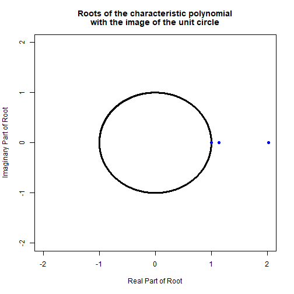

```
## 
## --------------------------------------------------------------------------------
## Restrictions imposed on the following parameters:
## - Psi. For details see "options$R_psi"
## --------------------------------------------------------------------------------
```

```r
# Conduct MVWN test on residuals.
MVWNtest_m1r1 <- MVWNtest(m1r1$Residuals, order, printWNtest)
```

```
## 
##        White Noise Test Results (lag = 12)
## ---------------------------------------------
## Variable |       Q  P-val |      LM  P-val  |
## ---------------------------------------------
## Multivar | 107.573  0.493 |     ----  ----  |
## Var1     |   7.719  0.807 |   9.463  0.663  |
## Var2     |  16.811  0.157 |  10.799  0.546  |
## Var3     |  17.846  0.120 |  20.913  0.052  |
## ---------------------------------------------
```

```r
# Test the null of m1r1 against the alternative m1.
Hdb <- FCVARhypoTest(m1, m1r1)
```

```
## Likelihood ratio test results:
## Unrestricted log-likelihood: 451.174
## Restricted log-likelihood:   442.027
## Test results (df = 1):
## LR statistic: 	 18.295
## P-value: 	 0.000
```

```r
# Test restriction that political variables do not enter the cointegrating relation(s).
```

```r
# Set options to impose restriction.
opt1 <- opt
opt1$R_Beta <- matrix(c(1, 0, 0), nrow = 1, ncol = 3)


# Estimate model and store in an FCVARmodel object.
m1r2 <- FCVARestn(x1, k, r, opt1)
```

```
## 
## --------------------------------------------------------------------------------
##                       Fractionally Cointegrated VAR: Estimation Results                              
## --------------------------------------------------------------------------------
## Dimension of system:       3      Number of observations in sample:          316 
## Number of lags:            2      Number of observations for estimation:     316 
## Restricted constant:      No      Initial values:                              0
## Unrestricted constant:    No      Level parameter:                           Yes
## Starting value for d:    0.800    Parameter space for d: (0.010 , 2.000) 
## Starting value for b:    0.800    Parameter space for b: (0.010 , 2.000) 
## --------------------------------------------------------------------------------
## Cointegrating rank:            1  AIC:              -836.791 
## Log-likelihood:          444.395  BIC:              -739.141 
## log(det(Omega_hat)):     -11.326  Free parameters:        26 
## --------------------------------------------------------------------------------
##     Fractional parameters:                                                                             
## --------------------------------------------------------------------------------
##     Coefficient               Estimate                Standard error 
## --------------------------------------------------------------------------------
##          d                       0.673                      0.058                
## --------------------------------------------------------------------------------
## --------------------------------------------------------------------------------
##     Cointegrating equations (beta):                                                                  
## --------------------------------------------------------------------------------
##       Variable        CI equation 1  
## --------------------------------------------------------------------------------
##         Var1              0.000     
##         Var2             -0.051     
##         Var3             -0.223     
## --------------------------------------------------------------------------------
##     Adjustment matrix (alpha):                                                                         
## --------------------------------------------------------------------------------
##       Variable        CI equation 1  
## --------------------------------------------------------------------------------
##         Var 1             0.032     
##          SE 1         (   0.080  )  
##         Var 2            -0.184     
##          SE 2         (   0.301  )  
##         Var 3            -0.042     
##          SE 3         (   0.016  )  
## --------------------------------------------------------------------------------
## Note: Standard errors in parenthesis.                                                                
## --------------------------------------------------------------------------------
##     Long-run matrix (Pi):                                                                       
## --------------------------------------------------------------------------------
##       Variable         Var 1          Var 2          Var 3   
## --------------------------------------------------------------------------------
##       Var 1            0.000         -0.002         -0.007    
##       Var 2            0.000          0.009          0.041    
##       Var 3            0.000          0.002          0.009    
## --------------------------------------------------------------------------------
## 
## --------------------------------------------------------------------------------
##     Level parameter (mu):                                                                         
## --------------------------------------------------------------------------------
##         Var 1            -0.030     
##          SE 1         (   0.162  )  
##         Var 2            11.525     
##          SE 2         (   0.529  )  
##         Var 3            -2.874     
##          SE 3         (   0.033  )  
## --------------------------------------------------------------------------------
## Note: Standard errors in parenthesis (from numerical Hessian) 
##       but asymptotic distribution is unknown. 
## --------------------------------------------------------------------------------
##     Lag matrix 1 (Gamma_1):                                                                            
## --------------------------------------------------------------------------------
##       Variable         Var 1          Var 2          Var 3   
## --------------------------------------------------------------------------------
##       Var 1           -0.038         -0.043         -0.665    
##        SE 1        (   0.112  )   (   0.024  )   (   0.440  )  
##       Var 2            0.018          0.803         -2.387    
##        SE 2        (   0.295  )   (   0.177  )   (   1.571  )  
##       Var 3           -0.023          0.010          0.471    
##        SE 3        (   0.016  )   (   0.005  )   (   0.140  )  
## --------------------------------------------------------------------------------
## Note: Standard errors in parentheses.                                                                
## --------------------------------------------------------------------------------
##     Lag matrix 2 (Gamma_2):                                                                            
## --------------------------------------------------------------------------------
##       Variable         Var 1          Var 2          Var 3   
## --------------------------------------------------------------------------------
##       Var 1            0.234          0.030          0.475    
##        SE 1        (   0.133  )   (   0.031  )   (   0.555  )  
##       Var 2            0.616         -0.222         -2.252    
##        SE 2        (   0.420  )   (   0.152  )   (   2.071  )  
##       Var 3           -0.009         -0.014          0.300    
##        SE 3        (   0.023  )   (   0.006  )   (   0.107  )  
## --------------------------------------------------------------------------------
## Note: Standard errors in parentheses.                                                                
## --------------------------------------------------------------------------------
## --------------------------------------------------------------------------------
##     Roots of the characteristic polynomial                                                           
## --------------------------------------------------------------------------------
##     Number     Real part    Imaginary part       Modulus                                             
## --------------------------------------------------------------------------------
##        1         -2.104         -0.107            2.106                                        
##        2         -2.104          0.107            2.106                                        
##        3          1.991          0.000            1.991                                        
##        4          1.256         -1.284            1.796                                        
##        5          1.256          1.284            1.796                                        
##        6          1.035         -0.077            1.037                                        
##        7          1.035          0.077            1.037                                        
##        8          1.000          0.000            1.000                                        
##        9          1.000          0.000            1.000                                        
## --------------------------------------------------------------------------------
```

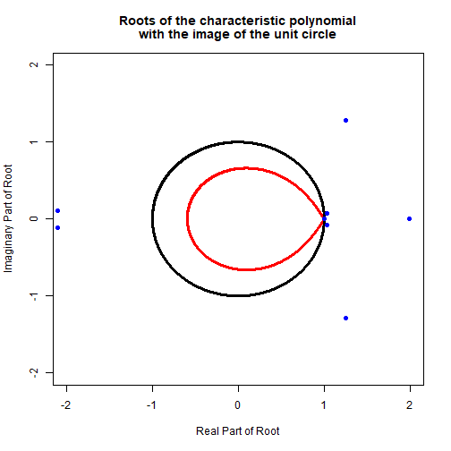

```
## 
## --------------------------------------------------------------------------------
## Restrictions imposed on the following parameters:
## - Psi. For details see "options$R_psi"
## - Beta. For details see "options$R_Beta"
## --------------------------------------------------------------------------------
```

```r
# Conduct MVWN test on residuals.
MVWNtest_m1r2 <- MVWNtest(m1r2$Residuals, order, printWNtest)
```

```
## 
##        White Noise Test Results (lag = 12)
## ---------------------------------------------
## Variable |       Q  P-val |      LM  P-val  |
## ---------------------------------------------
## Multivar |  98.175  0.740 |     ----  ----  |
## Var1     |  10.815  0.545 |  11.459  0.490  |
## Var2     |  13.638  0.324 |   8.282  0.763  |
## Var3     |  13.197  0.355 |  14.256  0.285  |
## ---------------------------------------------
```

```r
# Test the null of m1r2 against the alternative m1.
Hbeta1 <- FCVARhypoTest(m1, m1r2)
```

```
## Likelihood ratio test results:
## Unrestricted log-likelihood: 451.174
## Restricted log-likelihood:   444.395
## Test results (df = 1):
## LR statistic: 	 13.557
## P-value: 	 0.000
```

```r
# Test restriction that political variable is long-run exogenous.
```

```r
# Set options to impose restriction.
opt1 <- opt
opt1$R_Alpha <- matrix(c(1, 0, 0), nrow = 1, ncol = 3)


# Estimate model and store in an FCVARmodel object.
m1r3 <- FCVARestn(x1, k, r, opt1)
```

```
## 
## --------------------------------------------------------------------------------
##                       Fractionally Cointegrated VAR: Estimation Results                              
## --------------------------------------------------------------------------------
## Dimension of system:       3      Number of observations in sample:          316 
## Number of lags:            2      Number of observations for estimation:     316 
## Restricted constant:      No      Initial values:                              0
## Unrestricted constant:    No      Level parameter:                           Yes
## Starting value for d:    0.800    Parameter space for d: (0.010 , 2.000) 
## Starting value for b:    0.800    Parameter space for b: (0.010 , 2.000) 
## --------------------------------------------------------------------------------
## Cointegrating rank:            1  AIC:              -840.171 
## Log-likelihood:          446.086  BIC:              -742.522 
## log(det(Omega_hat)):     -11.337  Free parameters:        26 
## --------------------------------------------------------------------------------
##     Fractional parameters:                                                                             
## --------------------------------------------------------------------------------
##     Coefficient               Estimate                Standard error 
## --------------------------------------------------------------------------------
##          d                       0.600                      0.051                
## --------------------------------------------------------------------------------
## --------------------------------------------------------------------------------
##     Cointegrating equations (beta):                                                                  
## --------------------------------------------------------------------------------
##       Variable        CI equation 1  
## --------------------------------------------------------------------------------
##         Var1              0.835     
##         Var2              0.124     
##         Var3             -0.041     
## --------------------------------------------------------------------------------
##     Adjustment matrix (alpha):                                                                         
## --------------------------------------------------------------------------------
##       Variable        CI equation 1  
## --------------------------------------------------------------------------------
##         Var 1             0.000     
##          SE 1         (   0.000  )  
##         Var 2             0.189     
##          SE 2         (   0.178  )  
##         Var 3             0.034     
##          SE 3         (   0.012  )  
## --------------------------------------------------------------------------------
## Note: Standard errors in parenthesis.                                                                
## --------------------------------------------------------------------------------
##     Long-run matrix (Pi):                                                                       
## --------------------------------------------------------------------------------
##       Variable         Var 1          Var 2          Var 3   
## --------------------------------------------------------------------------------
##       Var 1            0.000          0.000          0.000    
##       Var 2            0.158          0.023         -0.008    
##       Var 3            0.028          0.004         -0.001    
## --------------------------------------------------------------------------------
## 
## --------------------------------------------------------------------------------
##     Level parameter (mu):                                                                         
## --------------------------------------------------------------------------------
##         Var 1            -0.342     
##          SE 1         (   0.093  )  
##         Var 2            11.451     
##          SE 2         (   0.538  )  
##         Var 3            -2.869     
##          SE 3         (   0.033  )  
## --------------------------------------------------------------------------------
## Note: Standard errors in parenthesis (from numerical Hessian) 
##       but asymptotic distribution is unknown. 
## --------------------------------------------------------------------------------
##     Lag matrix 1 (Gamma_1):                                                                            
## --------------------------------------------------------------------------------
##       Variable         Var 1          Var 2          Var 3   
## --------------------------------------------------------------------------------
##       Var 1            0.080         -0.043         -0.702    
##        SE 1        (   0.126  )   (   0.026  )   (   0.495  )  
##       Var 2           -0.146          1.015         -2.977    
##        SE 2        (   0.349  )   (   0.190  )   (   1.838  )  
##       Var 3           -0.044          0.008          0.623    
##        SE 3        (   0.020  )   (   0.005  )   (   0.156  )  
## --------------------------------------------------------------------------------
## Note: Standard errors in parentheses.                                                                
## --------------------------------------------------------------------------------
##     Lag matrix 2 (Gamma_2):                                                                            
## --------------------------------------------------------------------------------
##       Variable         Var 1          Var 2          Var 3   
## --------------------------------------------------------------------------------
##       Var 1            0.333          0.023          0.611    
##        SE 1        (   0.142  )   (   0.032  )   (   0.599  )  
##       Var 2            0.518         -0.411         -0.711    
##        SE 2        (   0.499  )   (   0.191  )   (   2.459  )  
##       Var 3           -0.026         -0.021          0.306    
##        SE 3        (   0.028  )   (   0.008  )   (   0.129  )  
## --------------------------------------------------------------------------------
## Note: Standard errors in parentheses.                                                                
## --------------------------------------------------------------------------------
## --------------------------------------------------------------------------------
##     Roots of the characteristic polynomial                                                           
## --------------------------------------------------------------------------------
##     Number     Real part    Imaginary part       Modulus                                             
## --------------------------------------------------------------------------------
##        1         -2.224          0.000            2.224                                        
##        2         -2.172          0.000            2.172                                        
##        3          1.537          0.000            1.537                                        
##        4          1.089         -1.042            1.507                                        
##        5          1.089          1.042            1.507                                        
##        6          1.000          0.000            1.000                                        
##        7          1.000          0.000            1.000                                        
##        8          0.960         -0.136            0.970                                        
##        9          0.960          0.136            0.970                                        
## --------------------------------------------------------------------------------
```

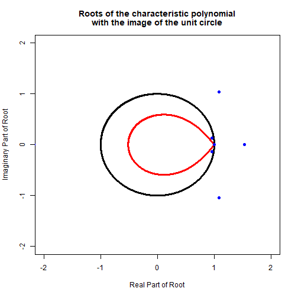

```
## 
## --------------------------------------------------------------------------------
## Restrictions imposed on the following parameters:
## - Psi. For details see "options$R_psi"
## - Alpha. For details see "options$R_Alpha"
## --------------------------------------------------------------------------------
```

```r
# Conduct MVWN test on residuals.
MVWNtest_m1r3 <- MVWNtest(m1r3$Residuals, order, printWNtest)
```

```
## 
##        White Noise Test Results (lag = 12)
## ---------------------------------------------
## Variable |       Q  P-val |      LM  P-val  |
## ---------------------------------------------
## Multivar |  97.479  0.756 |     ----  ----  |
## Var1     |  11.732  0.467 |  11.479  0.488  |
## Var2     |  13.989  0.301 |   8.219  0.768  |
## Var3     |  11.317  0.502 |  12.712  0.390  |
## ---------------------------------------------
```

```r
# Test the null of m1r3 against the alternative m1
Halpha1 <- FCVARhypoTest(m1, m1r3)
```

```
## Likelihood ratio test results:
## Unrestricted log-likelihood: 451.174
## Restricted log-likelihood:   446.086
## Test results (df = 1):
## LR statistic: 	 10.176
## P-value: 	 0.001
```

```r
# Test restriction that interest-rate is long-run exogenous.
```

```r
# Set options to impose restriction.
opt1 <- opt
opt1$R_Alpha <- matrix(c(0, 1, 0), nrow = 1, ncol = 3)


# Estimate model and store in an FCVARmodel object.
m1r4 <- FCVARestn(x1, k, r, opt1)
```

```
## 
## --------------------------------------------------------------------------------
##                       Fractionally Cointegrated VAR: Estimation Results                              
## --------------------------------------------------------------------------------
## Dimension of system:       3      Number of observations in sample:          316 
## Number of lags:            2      Number of observations for estimation:     316 
## Restricted constant:      No      Initial values:                              0
## Unrestricted constant:    No      Level parameter:                           Yes
## Starting value for d:    0.800    Parameter space for d: (0.010 , 2.000) 
## Starting value for b:    0.800    Parameter space for b: (0.010 , 2.000) 
## --------------------------------------------------------------------------------
## Cointegrating rank:            1  AIC:              -849.715 
## Log-likelihood:          450.857  BIC:              -752.065 
## log(det(Omega_hat)):     -11.367  Free parameters:        26 
## --------------------------------------------------------------------------------
##     Fractional parameters:                                                                             
## --------------------------------------------------------------------------------
##     Coefficient               Estimate                Standard error 
## --------------------------------------------------------------------------------
##          d                       0.575                      0.048                
## --------------------------------------------------------------------------------
## --------------------------------------------------------------------------------
##     Cointegrating equations (beta):                                                                  
## --------------------------------------------------------------------------------
##       Variable        CI equation 1  
## --------------------------------------------------------------------------------
##         Var1              0.994     
##         Var2              0.105     
##         Var3             -0.181     
## --------------------------------------------------------------------------------
##     Adjustment matrix (alpha):                                                                         
## --------------------------------------------------------------------------------
##       Variable        CI equation 1  
## --------------------------------------------------------------------------------
##         Var 1            -0.189     
##          SE 1         (   0.065  )  
##         Var 2             0.000     
##          SE 2         (   0.000  )  
##         Var 3             0.039     
##          SE 3         (   0.014  )  
## --------------------------------------------------------------------------------
## Note: Standard errors in parenthesis.                                                                
## --------------------------------------------------------------------------------
##     Long-run matrix (Pi):                                                                       
## --------------------------------------------------------------------------------
##       Variable         Var 1          Var 2          Var 3   
## --------------------------------------------------------------------------------
##       Var 1           -0.188         -0.020          0.034    
##       Var 2            0.000          0.000          0.000    
##       Var 3            0.039          0.004         -0.007    
## --------------------------------------------------------------------------------
## 
## --------------------------------------------------------------------------------
##     Level parameter (mu):                                                                         
## --------------------------------------------------------------------------------
##         Var 1            -0.310     
##          SE 1         (   0.067  )  
##         Var 2            11.538     
##          SE 2         (   0.553  )  
##         Var 3            -2.873     
##          SE 3         (   0.033  )  
## --------------------------------------------------------------------------------
## Note: Standard errors in parenthesis (from numerical Hessian) 
##       but asymptotic distribution is unknown. 
## --------------------------------------------------------------------------------
##     Lag matrix 1 (Gamma_1):                                                                            
## --------------------------------------------------------------------------------
##       Variable         Var 1          Var 2          Var 3   
## --------------------------------------------------------------------------------
##       Var 1            0.269         -0.032         -0.512    
##        SE 1        (   0.157  )   (   0.026  )   (   0.507  )  
##       Var 2           -0.013          1.115         -3.001    
##        SE 2        (   0.345  )   (   0.189  )   (   1.909  )  
##       Var 3           -0.053          0.008          0.694    
##        SE 3        (   0.022  )   (   0.005  )   (   0.164  )  
## --------------------------------------------------------------------------------
## Note: Standard errors in parentheses.                                                                
## --------------------------------------------------------------------------------
##     Lag matrix 2 (Gamma_2):                                                                            
## --------------------------------------------------------------------------------
##       Variable         Var 1          Var 2          Var 3   
## --------------------------------------------------------------------------------
##       Var 1            0.570          0.104          0.585    
##        SE 1        (   0.184  )   (   0.044  )   (   0.606  )  
##       Var 2            0.685         -0.371          0.223    
##        SE 2        (   0.508  )   (   0.159  )   (   2.509  )  
##       Var 3           -0.043         -0.020          0.330    
##        SE 3        (   0.032  )   (   0.008  )   (   0.138  )  
## --------------------------------------------------------------------------------
## Note: Standard errors in parentheses.                                                                
## --------------------------------------------------------------------------------
## --------------------------------------------------------------------------------
##     Roots of the characteristic polynomial                                                           
## --------------------------------------------------------------------------------
##     Number     Real part    Imaginary part       Modulus                                             
## --------------------------------------------------------------------------------
##        1         -2.710          0.000            2.710                                        
##        2         -1.498          0.000            1.498                                        
##        3          1.129         -0.939            1.469                                        
##        4          1.129          0.939            1.469                                        
##        5          1.098          0.000            1.098                                        
##        6          1.000          0.000            1.000                                        
##        7          1.000          0.000            1.000                                        
##        8          0.934         -0.281            0.976                                        
##        9          0.934          0.281            0.976                                        
## --------------------------------------------------------------------------------
```

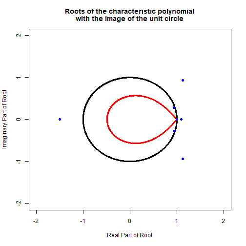

```
## 
## --------------------------------------------------------------------------------
## Restrictions imposed on the following parameters:
## - Psi. For details see "options$R_psi"
## - Alpha. For details see "options$R_Alpha"
## --------------------------------------------------------------------------------
```

```r
# Conduct MVWN test on residuals.
MVWNtest_m1r4 <- MVWNtest(m1r4$Residuals, order, printWNtest)
```

```
## 
##        White Noise Test Results (lag = 12)
## ---------------------------------------------
## Variable |       Q  P-val |      LM  P-val  |
## ---------------------------------------------
## Multivar |  97.665  0.752 |     ----  ----  |
## Var1     |   9.084  0.696 |  11.267  0.506  |
## Var2     |  14.931  0.245 |   9.338  0.674  |
## Var3     |  10.729  0.552 |  12.241  0.426  |
## ---------------------------------------------
```

```r
# Test the null of m1r4 against the alternative m1.
Halpha2 <- FCVARhypoTest(m1, m1r4)
```

```
## Likelihood ratio test results:
## Unrestricted log-likelihood: 451.174
## Restricted log-likelihood:   450.857
## Test results (df = 1):
## LR statistic: 	 0.633
## P-value: 	 0.426
```

```r
# Test restriction that unemployment is long-run exogenous.
```

```r
# Set options to impose restriction.
opt1 <- opt
opt1$R_Alpha <- matrix(c(0, 0, 1), nrow = 1, ncol = 3)


# Estimate model and store in an FCVARmodel object.
m1r5 <- FCVARestn(x1, k, r, opt1)
```

```
## 
## --------------------------------------------------------------------------------
##                       Fractionally Cointegrated VAR: Estimation Results                              
## --------------------------------------------------------------------------------
## Dimension of system:       3      Number of observations in sample:          316 
## Number of lags:            2      Number of observations for estimation:     316 
## Restricted constant:      No      Initial values:                              0
## Unrestricted constant:    No      Level parameter:                           Yes
## Starting value for d:    0.800    Parameter space for d: (0.010 , 2.000) 
## Starting value for b:    0.800    Parameter space for b: (0.010 , 2.000) 
## --------------------------------------------------------------------------------
## Cointegrating rank:            1  AIC:              -840.368 
## Log-likelihood:          446.184  BIC:              -742.719 
## log(det(Omega_hat)):     -11.338  Free parameters:        26 
## --------------------------------------------------------------------------------
##     Fractional parameters:                                                                             
## --------------------------------------------------------------------------------
##     Coefficient               Estimate                Standard error 
## --------------------------------------------------------------------------------
##          d                       0.630                      0.056                
## --------------------------------------------------------------------------------
## --------------------------------------------------------------------------------
##     Cointegrating equations (beta):                                                                  
## --------------------------------------------------------------------------------
##       Variable        CI equation 1  
## --------------------------------------------------------------------------------
##         Var1             -1.150     
##         Var2             -0.083     
##         Var3              0.049     
## --------------------------------------------------------------------------------
##     Adjustment matrix (alpha):                                                                         
## --------------------------------------------------------------------------------
##       Variable        CI equation 1  
## --------------------------------------------------------------------------------
##         Var 1             0.167     
##          SE 1         (   0.056  )  
##         Var 2            -0.089     
##          SE 2         (   0.165  )  
##         Var 3             0.000     
##          SE 3         (   0.000  )  
## --------------------------------------------------------------------------------
## Note: Standard errors in parenthesis.                                                                
## --------------------------------------------------------------------------------
##     Long-run matrix (Pi):                                                                       
## --------------------------------------------------------------------------------
##       Variable         Var 1          Var 2          Var 3   
## --------------------------------------------------------------------------------
##       Var 1           -0.192         -0.014          0.008    
##       Var 2            0.103          0.007         -0.004    
##       Var 3            0.000          0.000          0.000    
## --------------------------------------------------------------------------------
## 
## --------------------------------------------------------------------------------
##     Level parameter (mu):                                                                         
## --------------------------------------------------------------------------------
##         Var 1            -0.160     
##          SE 1         (   0.063  )  
##         Var 2            11.664     
##          SE 2         (   0.573  )  
##         Var 3            -2.880     
##          SE 3         (   0.033  )  
## --------------------------------------------------------------------------------
## Note: Standard errors in parenthesis (from numerical Hessian) 
##       but asymptotic distribution is unknown. 
## --------------------------------------------------------------------------------
##     Lag matrix 1 (Gamma_1):                                                                            
## --------------------------------------------------------------------------------
##       Variable         Var 1          Var 2          Var 3   
## --------------------------------------------------------------------------------
##       Var 1            0.177         -0.036         -0.583    
##        SE 1        (   0.148  )   (   0.024  )   (   0.458  )  
##       Var 2           -0.077          0.934         -2.528    
##        SE 2        (   0.350  )   (   0.194  )   (   1.707  )  
##       Var 3           -0.022          0.012          0.596    
##        SE 3        (   0.017  )   (   0.005  )   (   0.152  )  
## --------------------------------------------------------------------------------
## Note: Standard errors in parentheses.                                                                
## --------------------------------------------------------------------------------
##     Lag matrix 2 (Gamma_2):                                                                            
## --------------------------------------------------------------------------------
##       Variable         Var 1          Var 2          Var 3   
## --------------------------------------------------------------------------------
##       Var 1            0.507          0.077          0.322    
##        SE 1        (   0.191  )   (   0.035  )   (   0.554  )  
##       Var 2            0.538         -0.292         -0.941    
##        SE 2        (   0.502  )   (   0.156  )   (   2.340  )  
##       Var 3           -0.006         -0.006          0.387    
##        SE 3        (   0.025  )   (   0.006  )   (   0.116  )  
## --------------------------------------------------------------------------------
## Note: Standard errors in parentheses.                                                                
## --------------------------------------------------------------------------------
## --------------------------------------------------------------------------------
##     Roots of the characteristic polynomial                                                           
## --------------------------------------------------------------------------------
##     Number     Real part    Imaginary part       Modulus                                             
## --------------------------------------------------------------------------------
##        1         -2.527          0.000            2.527                                        
##        2          1.297         -1.005            1.641                                        
##        3          1.297          1.005            1.641                                        
##        4         -1.434          0.000            1.434                                        
##        5          1.058         -0.317            1.104                                        
##        6          1.058          0.317            1.104                                        
##        7          1.090          0.000            1.090                                        
##        8          1.000          0.000            1.000                                        
##        9          1.000          0.000            1.000                                        
## --------------------------------------------------------------------------------
```


```
## 
## --------------------------------------------------------------------------------
## Restrictions imposed on the following parameters:
## - Psi. For details see "options$R_psi"
## - Alpha. For details see "options$R_Alpha"
## --------------------------------------------------------------------------------
```

```r
# Conduct MVWN test on residuals.
MVWNtest_m1r5 <- MVWNtest(m1r5$Residuals, order, printWNtest)
```

```
## 
##        White Noise Test Results (lag = 12)
## ---------------------------------------------
## Variable |       Q  P-val |      LM  P-val  |
## ---------------------------------------------
## Multivar | 102.378  0.634 |     ----  ----  |
## Var1     |   8.690  0.729 |  11.838  0.459  |
## Var2     |  14.395  0.276 |   8.668  0.731  |
## Var3     |  12.109  0.437 |  12.916  0.375  |
## ---------------------------------------------
```

```r
# Test the null of m1r5 against the alternative m1.
Halpha3 <- FCVARhypoTest(m1, m1r5)
```

```
## Likelihood ratio test results:
## Unrestricted log-likelihood: 451.174
## Restricted log-likelihood:   446.184
## Test results (df = 1):
## LR statistic: 	 9.979
## P-value: 	 0.002
```

```r
# RESTRICTED MODEL OUTPUT
#   - print normalized beta and alpha for model m1r4.
```

```r
# Assign model.
modelRstrct <- m1r4

# Perform Normalization.
G <- solve(modelRstrct$coeffs$betaHat[1:r, 1:r])
betaHatR <- modelRstrct$coeffs$betaHat %*% G
# alphaHat is post multiplied by G^{-1} so that pi = a(G^{-1})Gb' = ab'
alphaHatR <- modelRstrct$coeffs$alphaHat %*% t(solve(G))


# Print output.
print("betaHatR' = ")
```

```
## [1] "betaHatR' = "
```

```r
print(t(betaHatR), print.gap = 5)
```

```
##          [,1]          [,2]           [,3]
## [1,]        1     0.1057173     -0.1824022
```

```r
print("alphaHatR' = ")
```

```
## [1] "alphaHatR' = "
```

```r
print(t(alphaHatR), print.gap = 5)
```

```
##                [,1]     [,2]           [,3]
## [1,]     -0.1876696        0     0.03856341
```

```r
################################################################################
# Forecasting with the FCVAR Model
################################################################################


# Forecast from the final restricted model.
NumPeriods <- 12 # forecast horizon set to 12 months ahead.

# Assign the model whose coefficients will be used for forecasting.
modelF <- m1r4

# Calculate the forecasts.
xf <- FCVARforecast(x1, modelF, NumPeriods)


# Append forecast to series.
seriesF <- as.matrix(rbind(x1, xf) )

# Equilibrium relation including forecasts.
equilF <- seriesF %*% modelF$coeffs$betaHat
```

```r
# Plot the series and forecast.
```

```r
# Determine the size of the vertical line to delimit data and forecast
#   values.
T_xf <- nrow(x1)
yMaxS  <- max(seriesF)
yMinS  <- min(seriesF)
yMaxEq <- max(equilF)
yMinEq <- min(equilF)

# Plot the series and forecast.
color_list <- rainbow(ncol(seriesF))
label_list <- c('Liberal Support', 'CDN 3-mo T-Bill', 'CDN Unemp. Rate')
lty_list <- c('solid', 'dashed', 'dot')
col_num <- 1
plot(seriesF[, col_num],
     main = 'Series, including Forecast',
     xlab = 'Time, t',
     ylab = 'Series',
     ylim = c(yMinS, yMaxS),
     type = 'l',
     lwd = 3,
     col = color_list[col_num])
abline(v = T_xf, col = 'black', lwd = 3, lty = 'dashed')
for (col_num in 2:ncol(seriesF)) {
  lines(seriesF[, col_num],
        lwd = 3,
        lty = col_num,
        col = color_list[col_num])
}
legend(197, 22.75, legend = label_list,
       col = color_list, lty = 1:3, cex = 0.65)
```

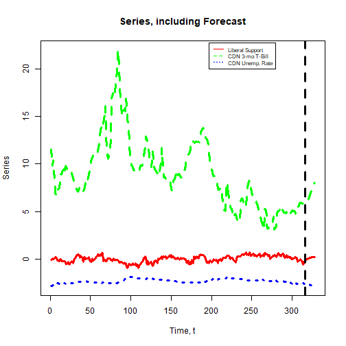

```r
# Plot the equilibrium relation including forecasts.
plot(equilF,
     main = 'Equilibrium Relation, including Forecast',
     xlab = 'Time, t',
     ylab = 'Equilibrium Relation',
     ylim = c(yMinEq, yMaxEq),
     type = 'l',
     lwd = 3,
     col = 'black')
abline(v = T_xf, col = 'black', lwd = 3, lty = 'dashed')
```

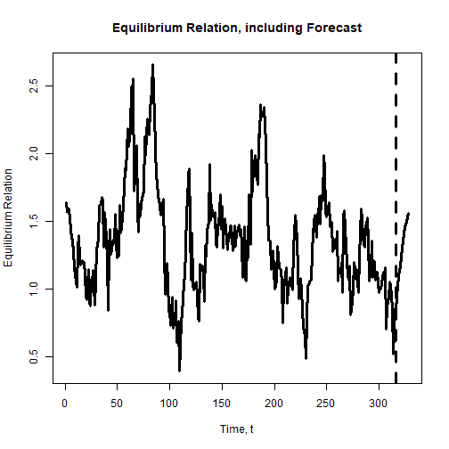

```r
################################################################################
# Bootstrap Hypothesis Test
################################################################################


# Test restriction that political variables do not enter the
#   cointegrating relation(s).

# Turn off plots for bootstrapping.
opt$plotRoots <- 0

# Define estimation options for unrestricted model (alternative)
optUNR <- opt

# Define estimation options for restricted model (null)
optRES <- opt
optRES$R_Beta <- matrix(c(1, 0, 0), nrow = 1, ncol = 3)

# Number of bootstrap samples to generate
B <- 999

# Generate bootstrap samples and calculate statistics.
set.seed(42)
FCVARboot_stats <- FCVARboot(x1, k, r, optRES, optUNR, B)
```

```
## 
## Hypothesis test to bootstrap:
## Likelihood ratio test results:
## Unrestricted log-likelihood: 451.174
## Restricted log-likelihood:   444.395
## Test results (df = 1):
## LR statistic: 	 13.557
## P-value: 	 0.000
```

```
## Completed bootstrap replication 9 of 999.
```

```
## Completed bootstrap replication 19 of 999.
```

```
## Completed bootstrap replication 29 of 999.
```

```
## Completed bootstrap replication 39 of 999.
```

```
## Completed bootstrap replication 49 of 999.
```

```
## Completed bootstrap replication 59 of 999.
```

```
## Completed bootstrap replication 69 of 999.
```

```
## Completed bootstrap replication 79 of 999.
```

```
## Completed bootstrap replication 89 of 999.
```

```
## Completed bootstrap replication 99 of 999.
```

```
## Completed bootstrap replication 109 of 999.
```

```
## Completed bootstrap replication 119 of 999.
```

```
## Completed bootstrap replication 129 of 999.
```

```
## Completed bootstrap replication 139 of 999.
```

```
## Completed bootstrap replication 149 of 999.
```

```
## Completed bootstrap replication 159 of 999.
```

```
## Completed bootstrap replication 169 of 999.
```

```
## Completed bootstrap replication 179 of 999.
```

```
## Completed bootstrap replication 189 of 999.
```

```
## Completed bootstrap replication 199 of 999.
```

```
## Completed bootstrap replication 209 of 999.
```

```
## Completed bootstrap replication 219 of 999.
```

```
## Completed bootstrap replication 229 of 999.
```

```
## Completed bootstrap replication 239 of 999.
```

```
## Completed bootstrap replication 249 of 999.
```

```
## Completed bootstrap replication 259 of 999.
```

```
## Completed bootstrap replication 269 of 999.
```

```
## Completed bootstrap replication 279 of 999.
```

```
## Completed bootstrap replication 289 of 999.
```

```
## Completed bootstrap replication 299 of 999.
```

```
## Completed bootstrap replication 309 of 999.
```

```
## Completed bootstrap replication 319 of 999.
```

```
## Completed bootstrap replication 329 of 999.
```

```
## Completed bootstrap replication 339 of 999.
```

```
## Completed bootstrap replication 349 of 999.
```

```
## Completed bootstrap replication 359 of 999.
```

```
## Completed bootstrap replication 369 of 999.
```

```
## Completed bootstrap replication 379 of 999.
```

```
## Completed bootstrap replication 389 of 999.
```

```
## Completed bootstrap replication 399 of 999.
```

```
## Completed bootstrap replication 409 of 999.
```

```
## Completed bootstrap replication 419 of 999.
```

```
## Completed bootstrap replication 429 of 999.
```

```
## Completed bootstrap replication 439 of 999.
```

```
## Completed bootstrap replication 449 of 999.
```

```
## Completed bootstrap replication 459 of 999.
```

```
## Completed bootstrap replication 469 of 999.
```

```
## Completed bootstrap replication 479 of 999.
```

```
## Completed bootstrap replication 489 of 999.
```

```
## Completed bootstrap replication 499 of 999.
```

```
## Completed bootstrap replication 509 of 999.
```

```
## Completed bootstrap replication 519 of 999.
```

```
## Completed bootstrap replication 529 of 999.
```

```
## Completed bootstrap replication 539 of 999.
```

```
## Completed bootstrap replication 549 of 999.
```

```
## Completed bootstrap replication 559 of 999.
```

```
## Completed bootstrap replication 569 of 999.
```

```
## Completed bootstrap replication 579 of 999.
```

```
## Completed bootstrap replication 589 of 999.
```

```
## Completed bootstrap replication 599 of 999.
```

```
## Completed bootstrap replication 609 of 999.
```

```
## Completed bootstrap replication 619 of 999.
```

```
## Completed bootstrap replication 629 of 999.
```

```
## Completed bootstrap replication 639 of 999.
```

```
## Completed bootstrap replication 649 of 999.
```

```
## Completed bootstrap replication 659 of 999.
```

```
## Completed bootstrap replication 669 of 999.
```

```
## Completed bootstrap replication 679 of 999.
```

```
## Completed bootstrap replication 689 of 999.
```

```
## Completed bootstrap replication 699 of 999.
```

```
## Completed bootstrap replication 709 of 999.
```

```
## Completed bootstrap replication 719 of 999.
```

```
## Completed bootstrap replication 729 of 999.
```

```
## Completed bootstrap replication 739 of 999.
```

```
## Completed bootstrap replication 749 of 999.
```

```
## Completed bootstrap replication 759 of 999.
```

```
## Completed bootstrap replication 769 of 999.
```

```
## Completed bootstrap replication 779 of 999.
```

```
## Completed bootstrap replication 789 of 999.
```

```
## Completed bootstrap replication 799 of 999.
```

```
## Completed bootstrap replication 809 of 999.
```

```
## Completed bootstrap replication 819 of 999.
```

```
## Completed bootstrap replication 829 of 999.
```

```
## Completed bootstrap replication 839 of 999.
```

```
## Completed bootstrap replication 849 of 999.
```

```
## Completed bootstrap replication 859 of 999.
```

```
## Completed bootstrap replication 869 of 999.
```

```
## Completed bootstrap replication 879 of 999.
```

```
## Completed bootstrap replication 889 of 999.
```

```
## Completed bootstrap replication 899 of 999.
```

```
## Completed bootstrap replication 909 of 999.
```

```
## Completed bootstrap replication 919 of 999.
```

```
## Completed bootstrap replication 929 of 999.
```

```
## Completed bootstrap replication 939 of 999.
```

```
## Completed bootstrap replication 949 of 999.
```

```
## Completed bootstrap replication 959 of 999.
```

```
## Completed bootstrap replication 969 of 999.
```

```
## Completed bootstrap replication 979 of 999.
```

```
## Completed bootstrap replication 989 of 999.
```

```
## Completed bootstrap replication 999 of 999.
```

```
## Bootstrap likelihood ratio test results:
## Unrestricted log-likelihood: 451.174
## Restricted log-likelihood:   444.395
## Test results (df = 1):
## LR statistic: 	 13.557
## P-value: 	 0.000
## P-value (BS): 	 0.022
```

```r
LRbs <- FCVARboot_stats$LRbs
H <- FCVARboot_stats$H
mBS <- FCVARboot_stats$mBS
mUNR <- FCVARboot_stats$mUNR
```

```r
# Compare the bootstrap distribution to chi-squared distribution
```

```r
# Estimate kernel density
LRbs_density <- density(LRbs)


# Plot bootstrap density with chi-squared density.
plot(LRbs_density,
     main = c('Bootstrap Density with Chi-squared Density',
              sprintf('(%d bootstrap samples and %d d.f.)',
                      B, H$df)),
     xlab = 'Likelihood Ratio Statistic',
     xlim = c(-20, 25),
     ylim = c(0, 0.5),
     lwd = 3,
     col = 'blue')
LR_range <- seq(min(LRbs_density$x), max(LRbs_density$x), by = 0.01)
lines(LR_range,
      dchisq(LR_range, df = H$df),
      col = 'red',
      lwd = 3,
      lty = 'dotted')
legend('topleft',
       c('Bootstrap', 'Chi-squared'),
       col = c('blue','red'),
       cex = 1.0,
       lty = c(1, 3))
```

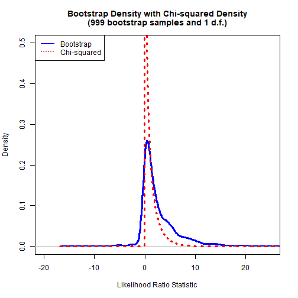

```r
################################################################################
# Bootstrap Rank Test
################################################################################


# Test rank 0 against rank 1
r1 <- 0
r2 <- 1

# Number of bootstrap samples to generate
B <- 999

# Generate bootstrap samples and calculate statistics.
set.seed(42)
FCVARbootRank_stats <- FCVARbootRank(x1, k, opt, r1, r2, B)
```

```
## Completed bootstrap replication 9 of 999.
```

```
## Completed bootstrap replication 19 of 999.
```

```
## Completed bootstrap replication 29 of 999.
```

```
## Completed bootstrap replication 39 of 999.
```

```
## Completed bootstrap replication 49 of 999.
```

```
## Completed bootstrap replication 59 of 999.
```

```
## Completed bootstrap replication 69 of 999.
```

```
## Completed bootstrap replication 79 of 999.
```

```
## Completed bootstrap replication 89 of 999.
```

```
## Completed bootstrap replication 99 of 999.
```

```
## Completed bootstrap replication 109 of 999.
```

```
## Completed bootstrap replication 119 of 999.
```

```
## Completed bootstrap replication 129 of 999.
```

```
## Completed bootstrap replication 139 of 999.
```

```
## Completed bootstrap replication 149 of 999.
```

```
## Completed bootstrap replication 159 of 999.
```

```
## Completed bootstrap replication 169 of 999.
```

```
## Completed bootstrap replication 179 of 999.
```

```
## Completed bootstrap replication 189 of 999.
```

```
## Completed bootstrap replication 199 of 999.
```

```
## Completed bootstrap replication 209 of 999.
```

```
## Completed bootstrap replication 219 of 999.
```

```
## Completed bootstrap replication 229 of 999.
```

```
## Completed bootstrap replication 239 of 999.
```

```
## Completed bootstrap replication 249 of 999.
```

```
## Completed bootstrap replication 259 of 999.
```

```
## Completed bootstrap replication 269 of 999.
```

```
## Completed bootstrap replication 279 of 999.
```

```
## Completed bootstrap replication 289 of 999.
```

```
## Completed bootstrap replication 299 of 999.
```

```
## Completed bootstrap replication 309 of 999.
```

```
## Completed bootstrap replication 319 of 999.
```

```
## Completed bootstrap replication 329 of 999.
```

```
## Completed bootstrap replication 339 of 999.
```

```
## Completed bootstrap replication 349 of 999.
```

```
## Completed bootstrap replication 359 of 999.
```

```
## Completed bootstrap replication 369 of 999.
```

```
## Completed bootstrap replication 379 of 999.
```

```
## Completed bootstrap replication 389 of 999.
```

```
## Completed bootstrap replication 399 of 999.
```

```
## Completed bootstrap replication 409 of 999.
```

```
## Completed bootstrap replication 419 of 999.
```

```
## Completed bootstrap replication 429 of 999.
```

```
## Completed bootstrap replication 439 of 999.
```

```
## Completed bootstrap replication 449 of 999.
```

```
## Completed bootstrap replication 459 of 999.
```

```
## Completed bootstrap replication 469 of 999.
```

```
## Completed bootstrap replication 479 of 999.
```

```
## Completed bootstrap replication 489 of 999.
```

```
## Completed bootstrap replication 499 of 999.
```

```
## Completed bootstrap replication 509 of 999.
```

```
## Completed bootstrap replication 519 of 999.
```

```
## Completed bootstrap replication 529 of 999.
```

```
## Completed bootstrap replication 539 of 999.
```

```
## Completed bootstrap replication 549 of 999.
```

```
## Completed bootstrap replication 559 of 999.
```

```
## Completed bootstrap replication 569 of 999.
```

```
## Completed bootstrap replication 579 of 999.
```

```
## Completed bootstrap replication 589 of 999.
```

```
## Completed bootstrap replication 599 of 999.
```

```
## Completed bootstrap replication 609 of 999.
```

```
## Completed bootstrap replication 619 of 999.
```

```
## Completed bootstrap replication 629 of 999.
```

```
## Completed bootstrap replication 639 of 999.
```

```
## Completed bootstrap replication 649 of 999.
```

```
## Completed bootstrap replication 659 of 999.
```

```
## Completed bootstrap replication 669 of 999.
```

```
## Completed bootstrap replication 679 of 999.
```

```
## Completed bootstrap replication 689 of 999.
```

```
## Completed bootstrap replication 699 of 999.
```

```
## Completed bootstrap replication 709 of 999.
```

```
## Completed bootstrap replication 719 of 999.
```

```
## Completed bootstrap replication 729 of 999.
```

```
## Completed bootstrap replication 739 of 999.
```

```
## Completed bootstrap replication 749 of 999.
```

```
## Completed bootstrap replication 759 of 999.
```

```
## Completed bootstrap replication 769 of 999.
```

```
## Completed bootstrap replication 779 of 999.
```

```
## Completed bootstrap replication 789 of 999.
```

```
## Completed bootstrap replication 799 of 999.
```

```
## Completed bootstrap replication 809 of 999.
```

```
## Completed bootstrap replication 819 of 999.
```

```
## Completed bootstrap replication 829 of 999.
```

```
## Completed bootstrap replication 839 of 999.
```

```
## Completed bootstrap replication 849 of 999.
```

```
## Completed bootstrap replication 859 of 999.
```

```
## Completed bootstrap replication 869 of 999.
```

```
## Completed bootstrap replication 879 of 999.
```

```
## Completed bootstrap replication 889 of 999.
```

```
## Completed bootstrap replication 899 of 999.
```

```
## Completed bootstrap replication 909 of 999.
```

```
## Completed bootstrap replication 919 of 999.
```

```
## Completed bootstrap replication 929 of 999.
```

```
## Completed bootstrap replication 939 of 999.
```

```
## Completed bootstrap replication 949 of 999.
```

```
## Completed bootstrap replication 959 of 999.
```

```
## Completed bootstrap replication 969 of 999.
```

```
## Completed bootstrap replication 979 of 999.
```

```
## Completed bootstrap replication 989 of 999.
```

```
## Completed bootstrap replication 999 of 999.
```

```
## Bootstrap rank test results:
## Unrestricted log-likelihood: 451.174
## Restricted log-likelihood:   440.040
## Test results:
## LR statistic: 	 22.268
## P-value (BS): 	 0.031
```

```r
LR_Rnk <- FCVARbootRank_stats$LRbs
H_Rnk <- FCVARbootRank_stats$H
mBSr1 <- FCVARbootRank_stats$mBS
mBSr2 <- FCVARbootRank_stats$mUNR
```

```r
# Compare to P-value based on asymptotic distribution
```

```r
rankTestStats <- FCVARrankTests(x1, k, opt)
```

```
## Estimating for k = 2 and r = 0.
```

```
## Finished Estimation for k = 2 and r = 0.
```

```
## Estimating for k = 2 and r = 1.
```

```
## Finished Estimation for k = 2 and r = 1.
```

```
## Estimating for k = 2 and r = 2.
```

```
## Finished Estimation for k = 2 and r = 2.
```

```
## Estimating for k = 2 and r = 3.
```

```
## Finished Estimation for k = 2 and r = 3.
```

```
## 
## --------------------------------------------------------------------------------
##              Likelihood Ratio Tests for Cointegrating Rank                               
## --------------------------------------------------------------------------------
## Dimension of system:       3     Number of observations in sample:          316 
## Number of lags:            2     Number of observations for estimation:     316 
## Restricted constant:      No     Initial values:                              0
## Unestricted constant:     No     Level parameter:                           Yes
## --------------------------------------------------------------------------------
## Rank     d      b     Log-likelihood   LR statistic   P-value
##  0     0.643  0.643          440.040         25.454     0.043
##  1     0.569  0.569          451.174          3.186     0.820
##  2     0.576  0.576          452.707          0.120     0.947
##  3     0.581  0.581          452.767           ----      ----
## --------------------------------------------------------------------------------
```

```r
cat(sprintf('P-value (asy): \t %1.3f\n', rankTestStats$pv[1]))
```

```
## P-value (asy): 	 0.043
```

```r
################################################################################
# Simulating from the FCVAR Model
################################################################################


# Simulate the final restricted model, the same one used for forecasting
#   above.

# Number of periods to simulate
T_sim <- 100

# Simulate data
set.seed(42)
x_sim <- FCVARsim(x1, modelF, T_sim)
```

```r
# Plot the simulated series
```

```r
yMaxS  <- max(x_sim)
yMinS  <- min(x_sim)

# Plot the series and forecast.
color_list <- rainbow(ncol(x_sim))
col_num <- 1
plot(x_sim[, col_num],
     main = 'Simulated Data',
     xlab = 'Time, t',
     ylab = 'Series',
     ylim = c(yMinS, yMaxS),
     type = 'l',
     lwd = 3,
     col = color_list[col_num])
for (col_num in 2:ncol(x_sim)) {
  lines(x_sim[, col_num],
        lwd = 3,
        lty = col_num,
        col = color_list[col_num])
}
legend('topleft', legend = label_list,
       col = color_list, lty = 1:3, cex = 0.65)
```

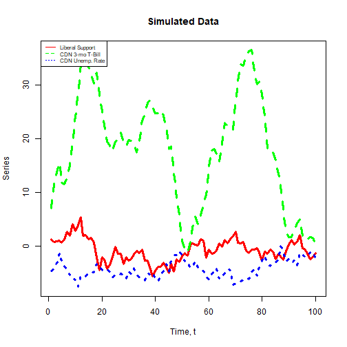

```r
################################################################################
# Grid Search for Local Optima
################################################################################

# Restrict equality of fractional parameters.
opt <- FCVARoptions()
opt$dbStep1D     <- 0.01
opt$dbMin        <- c(0.01, 0.01) # Set lower bound for d,b.
opt$dbMax        <- c(2.00, 2.00) # Set upper bound for d,b.
opt$constrained  <- 0 # impose restriction dbMax >= d >= b >= dbMin ? 1 <- yes, 0 <- no.
opt$restrictDB   <- 1 # impose restriction d=b ? 1 <- yes, 0 <- no.
opt$progress     <- 2 # Show progress report on each value of b.

likeGrid_params_eq_con <- FCVARlikeGrid(x1, k = 2, r = 1, opt)
```

```
## Now estimating for iteration 0 of 282: b = 0.014142.
```

```
## Now estimating for iteration 1 of 282: b = 0.024142.
```

```
## Now estimating for iteration 2 of 282: b = 0.034142.
```

```
## Now estimating for iteration 3 of 282: b = 0.044142.
```

```
## Now estimating for iteration 4 of 282: b = 0.054142.
```

```
## Now estimating for iteration 5 of 282: b = 0.064142.
```

```
## Now estimating for iteration 6 of 282: b = 0.074142.
```

```
## Now estimating for iteration 7 of 282: b = 0.084142.
```

```
## Now estimating for iteration 8 of 282: b = 0.094142.
```

```
## Now estimating for iteration 9 of 282: b = 0.104142.
```

```
## Now estimating for iteration 10 of 282: b = 0.114142.
```

```
## Now estimating for iteration 11 of 282: b = 0.124142.
```

```
## Now estimating for iteration 12 of 282: b = 0.134142.
```

```
## Now estimating for iteration 13 of 282: b = 0.144142.
```

```
## Now estimating for iteration 14 of 282: b = 0.154142.
```

```
## Now estimating for iteration 15 of 282: b = 0.164142.
```

```
## Now estimating for iteration 16 of 282: b = 0.174142.
```

```
## Now estimating for iteration 17 of 282: b = 0.184142.
```

```
## Now estimating for iteration 18 of 282: b = 0.194142.
```

```
## Now estimating for iteration 19 of 282: b = 0.204142.
```

```
## Now estimating for iteration 20 of 282: b = 0.214142.
```

```
## Now estimating for iteration 21 of 282: b = 0.224142.
```

```
## Now estimating for iteration 22 of 282: b = 0.234142.
```

```
## Now estimating for iteration 23 of 282: b = 0.244142.
```

```
## Now estimating for iteration 24 of 282: b = 0.254142.
```

```
## Now estimating for iteration 25 of 282: b = 0.264142.
```

```
## Now estimating for iteration 26 of 282: b = 0.274142.
```

```
## Now estimating for iteration 27 of 282: b = 0.284142.
```

```
## Now estimating for iteration 28 of 282: b = 0.294142.
```

```
## Now estimating for iteration 29 of 282: b = 0.304142.
```

```
## Now estimating for iteration 30 of 282: b = 0.314142.
```

```
## Now estimating for iteration 31 of 282: b = 0.324142.
```

```
## Now estimating for iteration 32 of 282: b = 0.334142.
```

```
## Now estimating for iteration 33 of 282: b = 0.344142.
```

```
## Now estimating for iteration 34 of 282: b = 0.354142.
```

```
## Now estimating for iteration 35 of 282: b = 0.364142.
```

```
## Now estimating for iteration 36 of 282: b = 0.374142.
```

```
## Now estimating for iteration 37 of 282: b = 0.384142.
```

```
## Now estimating for iteration 38 of 282: b = 0.394142.
```

```
## Now estimating for iteration 39 of 282: b = 0.404142.
```

```
## Now estimating for iteration 40 of 282: b = 0.414142.
```

```
## Now estimating for iteration 41 of 282: b = 0.424142.
```

```
## Now estimating for iteration 42 of 282: b = 0.434142.
```

```
## Now estimating for iteration 43 of 282: b = 0.444142.
```

```
## Now estimating for iteration 44 of 282: b = 0.454142.
```

```
## Now estimating for iteration 45 of 282: b = 0.464142.
```

```
## Now estimating for iteration 46 of 282: b = 0.474142.
```

```
## Now estimating for iteration 47 of 282: b = 0.484142.
```

```
## Now estimating for iteration 48 of 282: b = 0.494142.
```

```
## Now estimating for iteration 49 of 282: b = 0.504142.
```

```
## Now estimating for iteration 50 of 282: b = 0.514142.
```

```
## Now estimating for iteration 51 of 282: b = 0.524142.
```

```
## Now estimating for iteration 52 of 282: b = 0.534142.
```

```
## Now estimating for iteration 53 of 282: b = 0.544142.
```

```
## Now estimating for iteration 54 of 282: b = 0.554142.
```

```
## Now estimating for iteration 55 of 282: b = 0.564142.
```

```
## Now estimating for iteration 56 of 282: b = 0.574142.
```

```
## Now estimating for iteration 57 of 282: b = 0.584142.
```

```
## Now estimating for iteration 58 of 282: b = 0.594142.
```

```
## Now estimating for iteration 59 of 282: b = 0.604142.
```

```
## Now estimating for iteration 60 of 282: b = 0.614142.
```

```
## Now estimating for iteration 61 of 282: b = 0.624142.
```

```
## Now estimating for iteration 62 of 282: b = 0.634142.
```

```
## Now estimating for iteration 63 of 282: b = 0.644142.
```

```
## Now estimating for iteration 64 of 282: b = 0.654142.
```

```
## Now estimating for iteration 65 of 282: b = 0.664142.
```

```
## Now estimating for iteration 66 of 282: b = 0.674142.
```

```
## Now estimating for iteration 67 of 282: b = 0.684142.
```

```
## Now estimating for iteration 68 of 282: b = 0.694142.
```

```
## Now estimating for iteration 69 of 282: b = 0.704142.
```

```
## Now estimating for iteration 70 of 282: b = 0.714142.
```

```
## Now estimating for iteration 71 of 282: b = 0.724142.
```

```
## Now estimating for iteration 72 of 282: b = 0.734142.
```

```
## Now estimating for iteration 73 of 282: b = 0.744142.
```

```
## Now estimating for iteration 74 of 282: b = 0.754142.
```

```
## Now estimating for iteration 75 of 282: b = 0.764142.
```

```
## Now estimating for iteration 76 of 282: b = 0.774142.
```

```
## Now estimating for iteration 77 of 282: b = 0.784142.
```

```
## Now estimating for iteration 78 of 282: b = 0.794142.
```

```
## Now estimating for iteration 79 of 282: b = 0.804142.
```

```
## Now estimating for iteration 80 of 282: b = 0.814142.
```

```
## Now estimating for iteration 81 of 282: b = 0.824142.
```

```
## Now estimating for iteration 82 of 282: b = 0.834142.
```

```
## Now estimating for iteration 83 of 282: b = 0.844142.
```

```
## Now estimating for iteration 84 of 282: b = 0.854142.
```

```
## Now estimating for iteration 85 of 282: b = 0.864142.
```

```
## Now estimating for iteration 86 of 282: b = 0.874142.
```

```
## Now estimating for iteration 87 of 282: b = 0.884142.
```

```
## Now estimating for iteration 88 of 282: b = 0.894142.
```

```
## Now estimating for iteration 89 of 282: b = 0.904142.
```

```
## Now estimating for iteration 90 of 282: b = 0.914142.
```

```
## Now estimating for iteration 91 of 282: b = 0.924142.
```

```
## Now estimating for iteration 92 of 282: b = 0.934142.
```

```
## Now estimating for iteration 93 of 282: b = 0.944142.
```

```
## Now estimating for iteration 94 of 282: b = 0.954142.
```

```
## Now estimating for iteration 95 of 282: b = 0.964142.
```

```
## Now estimating for iteration 96 of 282: b = 0.974142.
```

```
## Now estimating for iteration 97 of 282: b = 0.984142.
```

```
## Now estimating for iteration 98 of 282: b = 0.994142.
```

```
## Now estimating for iteration 99 of 282: b = 1.004142.
```

```
## Now estimating for iteration 100 of 282: b = 1.014142.
```

```
## Now estimating for iteration 101 of 282: b = 1.024142.
```

```
## Now estimating for iteration 102 of 282: b = 1.034142.
```

```
## Now estimating for iteration 103 of 282: b = 1.044142.
```

```
## Now estimating for iteration 104 of 282: b = 1.054142.
```

```
## Now estimating for iteration 105 of 282: b = 1.064142.
```

```
## Now estimating for iteration 106 of 282: b = 1.074142.
```

```
## Now estimating for iteration 107 of 282: b = 1.084142.
```

```
## Now estimating for iteration 108 of 282: b = 1.094142.
```

```
## Now estimating for iteration 109 of 282: b = 1.104142.
```

```
## Now estimating for iteration 110 of 282: b = 1.114142.
```

```
## Now estimating for iteration 111 of 282: b = 1.124142.
```

```
## Now estimating for iteration 112 of 282: b = 1.134142.
```

```
## Now estimating for iteration 113 of 282: b = 1.144142.
```

```
## Now estimating for iteration 114 of 282: b = 1.154142.
```

```
## Now estimating for iteration 115 of 282: b = 1.164142.
```

```
## Now estimating for iteration 116 of 282: b = 1.174142.
```

```
## Now estimating for iteration 117 of 282: b = 1.184142.
```

```
## Now estimating for iteration 118 of 282: b = 1.194142.
```

```
## Now estimating for iteration 119 of 282: b = 1.204142.
```

```
## Now estimating for iteration 120 of 282: b = 1.214142.
```

```
## Now estimating for iteration 121 of 282: b = 1.224142.
```

```
## Now estimating for iteration 122 of 282: b = 1.234142.
```

```
## Now estimating for iteration 123 of 282: b = 1.244142.
```

```
## Now estimating for iteration 124 of 282: b = 1.254142.
```

```
## Now estimating for iteration 125 of 282: b = 1.264142.
```

```
## Now estimating for iteration 126 of 282: b = 1.274142.
```

```
## Now estimating for iteration 127 of 282: b = 1.284142.
```

```
## Now estimating for iteration 128 of 282: b = 1.294142.
```

```
## Now estimating for iteration 129 of 282: b = 1.304142.
```

```
## Now estimating for iteration 130 of 282: b = 1.314142.
```

```
## Now estimating for iteration 131 of 282: b = 1.324142.
```

```
## Now estimating for iteration 132 of 282: b = 1.334142.
```

```
## Now estimating for iteration 133 of 282: b = 1.344142.
```

```
## Now estimating for iteration 134 of 282: b = 1.354142.
```

```
## Now estimating for iteration 135 of 282: b = 1.364142.
```

```
## Now estimating for iteration 136 of 282: b = 1.374142.
```

```
## Now estimating for iteration 137 of 282: b = 1.384142.
```

```
## Now estimating for iteration 138 of 282: b = 1.394142.
```

```
## Now estimating for iteration 139 of 282: b = 1.404142.
```

```
## Now estimating for iteration 140 of 282: b = 1.414142.
```

```
## Now estimating for iteration 141 of 282: b = 1.424142.
```

```
## Now estimating for iteration 142 of 282: b = 1.434142.
```

```
## Now estimating for iteration 143 of 282: b = 1.444142.
```

```
## Now estimating for iteration 144 of 282: b = 1.454142.
```

```
## Now estimating for iteration 145 of 282: b = 1.464142.
```

```
## Now estimating for iteration 146 of 282: b = 1.474142.
```

```
## Now estimating for iteration 147 of 282: b = 1.484142.
```

```
## Now estimating for iteration 148 of 282: b = 1.494142.
```

```
## Now estimating for iteration 149 of 282: b = 1.504142.
```

```
## Now estimating for iteration 150 of 282: b = 1.514142.
```

```
## Now estimating for iteration 151 of 282: b = 1.524142.
```

```
## Now estimating for iteration 152 of 282: b = 1.534142.
```

```
## Now estimating for iteration 153 of 282: b = 1.544142.
```

```
## Now estimating for iteration 154 of 282: b = 1.554142.
```

```
## Now estimating for iteration 155 of 282: b = 1.564142.
```

```
## Now estimating for iteration 156 of 282: b = 1.574142.
```

```
## Now estimating for iteration 157 of 282: b = 1.584142.
```

```
## Now estimating for iteration 158 of 282: b = 1.594142.
```

```
## Now estimating for iteration 159 of 282: b = 1.604142.
```

```
## Now estimating for iteration 160 of 282: b = 1.614142.
```

```
## Now estimating for iteration 161 of 282: b = 1.624142.
```

```
## Now estimating for iteration 162 of 282: b = 1.634142.
```

```
## Now estimating for iteration 163 of 282: b = 1.644142.
```

```
## Now estimating for iteration 164 of 282: b = 1.654142.
```

```
## Now estimating for iteration 165 of 282: b = 1.664142.
```

```
## Now estimating for iteration 166 of 282: b = 1.674142.
```

```
## Now estimating for iteration 167 of 282: b = 1.684142.
```

```
## Now estimating for iteration 168 of 282: b = 1.694142.
```

```
## Now estimating for iteration 169 of 282: b = 1.704142.
```

```
## Now estimating for iteration 170 of 282: b = 1.714142.
```

```
## Now estimating for iteration 171 of 282: b = 1.724142.
```

```
## Now estimating for iteration 172 of 282: b = 1.734142.
```

```
## Now estimating for iteration 173 of 282: b = 1.744142.
```

```
## Now estimating for iteration 174 of 282: b = 1.754142.
```

```
## Now estimating for iteration 175 of 282: b = 1.764142.
```

```
## Now estimating for iteration 176 of 282: b = 1.774142.
```

```
## Now estimating for iteration 177 of 282: b = 1.784142.
```

```
## Now estimating for iteration 178 of 282: b = 1.794142.
```

```
## Now estimating for iteration 179 of 282: b = 1.804142.
```

```
## Now estimating for iteration 180 of 282: b = 1.814142.
```

```
## Now estimating for iteration 181 of 282: b = 1.824142.
```

```
## Now estimating for iteration 182 of 282: b = 1.834142.
```

```
## Now estimating for iteration 183 of 282: b = 1.844142.
```

```
## Now estimating for iteration 184 of 282: b = 1.854142.
```

```
## Now estimating for iteration 185 of 282: b = 1.864142.
```

```
## Now estimating for iteration 186 of 282: b = 1.874142.
```

```
## Now estimating for iteration 187 of 282: b = 1.884142.
```

```
## Now estimating for iteration 188 of 282: b = 1.894142.
```

```
## Now estimating for iteration 189 of 282: b = 1.904142.
```

```
## Now estimating for iteration 190 of 282: b = 1.914142.
```

```
## Now estimating for iteration 191 of 282: b = 1.924142.
```

```
## Now estimating for iteration 192 of 282: b = 1.934142.
```

```
## Now estimating for iteration 193 of 282: b = 1.944142.
```

```
## Now estimating for iteration 194 of 282: b = 1.954142.
```

```
## Now estimating for iteration 195 of 282: b = 1.964142.
```

```
## Now estimating for iteration 196 of 282: b = 1.974142.
```

```
## Now estimating for iteration 197 of 282: b = 1.984142.
```

```
## Now estimating for iteration 198 of 282: b = 1.994142.
```

```
## Now estimating for iteration 199 of 282: b = 2.004142.
```

```
## Now estimating for iteration 200 of 282: b = 2.014142.
```

```
## Now estimating for iteration 201 of 282: b = 2.024142.
```

```
## Now estimating for iteration 202 of 282: b = 2.034142.
```

```
## Now estimating for iteration 203 of 282: b = 2.044142.
```

```
## Now estimating for iteration 204 of 282: b = 2.054142.
```

```
## Now estimating for iteration 205 of 282: b = 2.064142.
```

```
## Now estimating for iteration 206 of 282: b = 2.074142.
```

```
## Now estimating for iteration 207 of 282: b = 2.084142.
```

```
## Now estimating for iteration 208 of 282: b = 2.094142.
```

```
## Now estimating for iteration 209 of 282: b = 2.104142.
```

```
## Now estimating for iteration 210 of 282: b = 2.114142.
```

```
## Now estimating for iteration 211 of 282: b = 2.124142.
```

```
## Now estimating for iteration 212 of 282: b = 2.134142.
```

```
## Now estimating for iteration 213 of 282: b = 2.144142.
```

```
## Now estimating for iteration 214 of 282: b = 2.154142.
```

```
## Now estimating for iteration 215 of 282: b = 2.164142.
```

```
## Now estimating for iteration 216 of 282: b = 2.174142.
```

```
## Now estimating for iteration 217 of 282: b = 2.184142.
```

```
## Now estimating for iteration 218 of 282: b = 2.194142.
```

```
## Now estimating for iteration 219 of 282: b = 2.204142.
```

```
## Now estimating for iteration 220 of 282: b = 2.214142.
```

```
## Now estimating for iteration 221 of 282: b = 2.224142.
```

```
## Now estimating for iteration 222 of 282: b = 2.234142.
```

```
## Now estimating for iteration 223 of 282: b = 2.244142.
```

```
## Now estimating for iteration 224 of 282: b = 2.254142.
```

```
## Now estimating for iteration 225 of 282: b = 2.264142.
```

```
## Now estimating for iteration 226 of 282: b = 2.274142.
```

```
## Now estimating for iteration 227 of 282: b = 2.284142.
```

```
## Now estimating for iteration 228 of 282: b = 2.294142.
```

```
## Now estimating for iteration 229 of 282: b = 2.304142.
```

```
## Now estimating for iteration 230 of 282: b = 2.314142.
```

```
## Now estimating for iteration 231 of 282: b = 2.324142.
```

```
## Now estimating for iteration 232 of 282: b = 2.334142.
```

```
## Now estimating for iteration 233 of 282: b = 2.344142.
```

```
## Now estimating for iteration 234 of 282: b = 2.354142.
```

```
## Now estimating for iteration 235 of 282: b = 2.364142.
```

```
## Now estimating for iteration 236 of 282: b = 2.374142.
```

```
## Now estimating for iteration 237 of 282: b = 2.384142.
```

```
## Now estimating for iteration 238 of 282: b = 2.394142.
```

```
## Now estimating for iteration 239 of 282: b = 2.404142.
```

```
## Now estimating for iteration 240 of 282: b = 2.414142.
```

```
## Now estimating for iteration 241 of 282: b = 2.424142.
```

```
## Now estimating for iteration 242 of 282: b = 2.434142.
```

```
## Now estimating for iteration 243 of 282: b = 2.444142.
```

```
## Now estimating for iteration 244 of 282: b = 2.454142.
```

```
## Now estimating for iteration 245 of 282: b = 2.464142.
```

```
## Now estimating for iteration 246 of 282: b = 2.474142.
```

```
## Now estimating for iteration 247 of 282: b = 2.484142.
```

```
## Now estimating for iteration 248 of 282: b = 2.494142.
```

```
## Now estimating for iteration 249 of 282: b = 2.504142.
```

```
## Now estimating for iteration 250 of 282: b = 2.514142.
```

```
## Now estimating for iteration 251 of 282: b = 2.524142.
```

```
## Now estimating for iteration 252 of 282: b = 2.534142.
```

```
## Now estimating for iteration 253 of 282: b = 2.544142.
```

```
## Now estimating for iteration 254 of 282: b = 2.554142.
```

```
## Now estimating for iteration 255 of 282: b = 2.564142.
```

```
## Now estimating for iteration 256 of 282: b = 2.574142.
```

```
## Now estimating for iteration 257 of 282: b = 2.584142.
```

```
## Now estimating for iteration 258 of 282: b = 2.594142.
```

```
## Now estimating for iteration 259 of 282: b = 2.604142.
```

```
## Now estimating for iteration 260 of 282: b = 2.614142.
```

```
## Now estimating for iteration 261 of 282: b = 2.624142.
```

```
## Now estimating for iteration 262 of 282: b = 2.634142.
```

```
## Now estimating for iteration 263 of 282: b = 2.644142.
```

```
## Now estimating for iteration 264 of 282: b = 2.654142.
```

```
## Now estimating for iteration 265 of 282: b = 2.664142.
```

```
## Now estimating for iteration 266 of 282: b = 2.674142.
```

```
## Now estimating for iteration 267 of 282: b = 2.684142.
```

```
## Now estimating for iteration 268 of 282: b = 2.694142.
```

```
## Now estimating for iteration 269 of 282: b = 2.704142.
```

```
## Now estimating for iteration 270 of 282: b = 2.714142.
```

```
## Now estimating for iteration 271 of 282: b = 2.724142.
```

```
## Now estimating for iteration 272 of 282: b = 2.734142.
```

```
## Now estimating for iteration 273 of 282: b = 2.744142.
```

```
## Now estimating for iteration 274 of 282: b = 2.754142.
```

```
## Now estimating for iteration 275 of 282: b = 2.764142.
```

```
## Now estimating for iteration 276 of 282: b = 2.774142.
```

```
## Now estimating for iteration 277 of 282: b = 2.784142.
```

```
## Now estimating for iteration 278 of 282: b = 2.794142.
```

```
## Now estimating for iteration 279 of 282: b = 2.804142.
```

```
## Now estimating for iteration 280 of 282: b = 2.814142.
```

```
## Now estimating for iteration 281 of 282: b = 2.824142.
```

```
## Progress : 100.0%, b = 0.57, d = 0.57, like = 451.174.
```

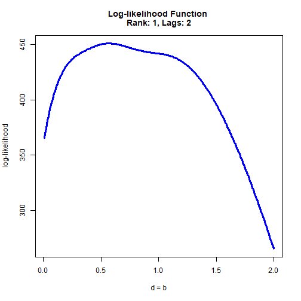

```r
# Linear restriction on fractional parameters.
opt <- FCVARoptions()
opt$dbStep1D     <- 0.01
opt$dbMin        <- c(0.01, 0.01) # Set lower bound for d,b.
opt$dbMax        <- c(2.00, 2.00) # Set upper bound for d,b.
opt$constrained  <- 0 # impose restriction dbMax >= d >= b >= dbMin ? 1 <- yes, 0 <- no.
opt$restrictDB   <- 0 # impose restriction d=b ? 1 <- yes, 0 <- no.
# Impose linear restriction on d and b:
opt$R_psi        <- matrix(c(2, -1), nrow = 1, ncol = 2)
opt$r_psi        <- 0.5
opt$progress     <- 2 # Show progress report on each value of b.

likeGrid_params_lin_con <- FCVARlikeGrid(x1, k = 2, r = 1, opt)
```

```
## Now estimating for iteration 0 of 223: b = 0.122984.
```

```
## Now estimating for iteration 1 of 223: b = 0.132984.
```

```
## Now estimating for iteration 2 of 223: b = 0.142984.
```

```
## Now estimating for iteration 3 of 223: b = 0.152984.
```

```
## Now estimating for iteration 4 of 223: b = 0.162984.
```

```
## Now estimating for iteration 5 of 223: b = 0.172984.
```

```
## Now estimating for iteration 6 of 223: b = 0.182984.
```

```
## Now estimating for iteration 7 of 223: b = 0.192984.
```

```
## Now estimating for iteration 8 of 223: b = 0.202984.
```

```
## Now estimating for iteration 9 of 223: b = 0.212984.
```

```
## Now estimating for iteration 10 of 223: b = 0.222984.
```

```
## Now estimating for iteration 11 of 223: b = 0.232984.
```

```
## Now estimating for iteration 12 of 223: b = 0.242984.
```

```
## Now estimating for iteration 13 of 223: b = 0.252984.
```

```
## Now estimating for iteration 14 of 223: b = 0.262984.
```

```
## Now estimating for iteration 15 of 223: b = 0.272984.
```

```
## Now estimating for iteration 16 of 223: b = 0.282984.
```

```
## Now estimating for iteration 17 of 223: b = 0.292984.
```

```
## Now estimating for iteration 18 of 223: b = 0.302984.
```

```
## Now estimating for iteration 19 of 223: b = 0.312984.
```

```
## Now estimating for iteration 20 of 223: b = 0.322984.
```

```
## Now estimating for iteration 21 of 223: b = 0.332984.
```

```
## Now estimating for iteration 22 of 223: b = 0.342984.
```

```
## Now estimating for iteration 23 of 223: b = 0.352984.
```

```
## Now estimating for iteration 24 of 223: b = 0.362984.
```

```
## Now estimating for iteration 25 of 223: b = 0.372984.
```

```
## Now estimating for iteration 26 of 223: b = 0.382984.
```

```
## Now estimating for iteration 27 of 223: b = 0.392984.
```

```
## Now estimating for iteration 28 of 223: b = 0.402984.
```

```
## Now estimating for iteration 29 of 223: b = 0.412984.
```

```
## Now estimating for iteration 30 of 223: b = 0.422984.
```

```
## Now estimating for iteration 31 of 223: b = 0.432984.
```

```
## Now estimating for iteration 32 of 223: b = 0.442984.
```

```
## Now estimating for iteration 33 of 223: b = 0.452984.
```

```
## Now estimating for iteration 34 of 223: b = 0.462984.
```

```
## Now estimating for iteration 35 of 223: b = 0.472984.
```

```
## Now estimating for iteration 36 of 223: b = 0.482984.
```

```
## Now estimating for iteration 37 of 223: b = 0.492984.
```

```
## Now estimating for iteration 38 of 223: b = 0.502984.
```

```
## Now estimating for iteration 39 of 223: b = 0.512984.
```

```
## Now estimating for iteration 40 of 223: b = 0.522984.
```

```
## Now estimating for iteration 41 of 223: b = 0.532984.
```

```
## Now estimating for iteration 42 of 223: b = 0.542984.
```

```
## Now estimating for iteration 43 of 223: b = 0.552984.
```

```
## Now estimating for iteration 44 of 223: b = 0.562984.
```

```
## Now estimating for iteration 45 of 223: b = 0.572984.
```

```
## Now estimating for iteration 46 of 223: b = 0.582984.
```

```
## Now estimating for iteration 47 of 223: b = 0.592984.
```

```
## Now estimating for iteration 48 of 223: b = 0.602984.
```

```
## Now estimating for iteration 49 of 223: b = 0.612984.
```

```
## Now estimating for iteration 50 of 223: b = 0.622984.
```

```
## Now estimating for iteration 51 of 223: b = 0.632984.
```

```
## Now estimating for iteration 52 of 223: b = 0.642984.
```

```
## Now estimating for iteration 53 of 223: b = 0.652984.
```

```
## Now estimating for iteration 54 of 223: b = 0.662984.
```

```
## Now estimating for iteration 55 of 223: b = 0.672984.
```

```
## Now estimating for iteration 56 of 223: b = 0.682984.
```

```
## Now estimating for iteration 57 of 223: b = 0.692984.
```

```
## Now estimating for iteration 58 of 223: b = 0.702984.
```

```
## Now estimating for iteration 59 of 223: b = 0.712984.
```

```
## Now estimating for iteration 60 of 223: b = 0.722984.
```

```
## Now estimating for iteration 61 of 223: b = 0.732984.
```

```
## Now estimating for iteration 62 of 223: b = 0.742984.
```

```
## Now estimating for iteration 63 of 223: b = 0.752984.
```

```
## Now estimating for iteration 64 of 223: b = 0.762984.
```

```
## Now estimating for iteration 65 of 223: b = 0.772984.
```

```
## Now estimating for iteration 66 of 223: b = 0.782984.
```

```
## Now estimating for iteration 67 of 223: b = 0.792984.
```

```
## Now estimating for iteration 68 of 223: b = 0.802984.
```

```
## Now estimating for iteration 69 of 223: b = 0.812984.
```

```
## Now estimating for iteration 70 of 223: b = 0.822984.
```

```
## Now estimating for iteration 71 of 223: b = 0.832984.
```

```
## Now estimating for iteration 72 of 223: b = 0.842984.
```

```
## Now estimating for iteration 73 of 223: b = 0.852984.
```

```
## Now estimating for iteration 74 of 223: b = 0.862984.
```

```
## Now estimating for iteration 75 of 223: b = 0.872984.
```

```
## Now estimating for iteration 76 of 223: b = 0.882984.
```

```
## Now estimating for iteration 77 of 223: b = 0.892984.
```

```
## Now estimating for iteration 78 of 223: b = 0.902984.
```

```
## Now estimating for iteration 79 of 223: b = 0.912984.
```

```
## Now estimating for iteration 80 of 223: b = 0.922984.
```

```
## Now estimating for iteration 81 of 223: b = 0.932984.
```

```
## Now estimating for iteration 82 of 223: b = 0.942984.
```

```
## Now estimating for iteration 83 of 223: b = 0.952984.
```

```
## Now estimating for iteration 84 of 223: b = 0.962984.
```

```
## Now estimating for iteration 85 of 223: b = 0.972984.
```

```
## Now estimating for iteration 86 of 223: b = 0.982984.
```

```
## Now estimating for iteration 87 of 223: b = 0.992984.
```

```
## Now estimating for iteration 88 of 223: b = 1.002984.
```

```
## Now estimating for iteration 89 of 223: b = 1.012984.
```

```
## Now estimating for iteration 90 of 223: b = 1.022984.
```

```
## Now estimating for iteration 91 of 223: b = 1.032984.
```

```
## Now estimating for iteration 92 of 223: b = 1.042984.
```

```
## Now estimating for iteration 93 of 223: b = 1.052984.
```

```
## Now estimating for iteration 94 of 223: b = 1.062984.
```

```
## Now estimating for iteration 95 of 223: b = 1.072984.
```

```
## Now estimating for iteration 96 of 223: b = 1.082984.
```

```
## Now estimating for iteration 97 of 223: b = 1.092984.
```

```
## Now estimating for iteration 98 of 223: b = 1.102984.
```

```
## Now estimating for iteration 99 of 223: b = 1.112984.
```

```
## Now estimating for iteration 100 of 223: b = 1.122984.
```

```
## Now estimating for iteration 101 of 223: b = 1.132984.
```

```
## Now estimating for iteration 102 of 223: b = 1.142984.
```

```
## Now estimating for iteration 103 of 223: b = 1.152984.
```

```
## Now estimating for iteration 104 of 223: b = 1.162984.
```

```
## Now estimating for iteration 105 of 223: b = 1.172984.
```

```
## Now estimating for iteration 106 of 223: b = 1.182984.
```

```
## Now estimating for iteration 107 of 223: b = 1.192984.
```

```
## Now estimating for iteration 108 of 223: b = 1.202984.
```

```
## Now estimating for iteration 109 of 223: b = 1.212984.
```

```
## Now estimating for iteration 110 of 223: b = 1.222984.
```

```
## Now estimating for iteration 111 of 223: b = 1.232984.
```

```
## Now estimating for iteration 112 of 223: b = 1.242984.
```

```
## Now estimating for iteration 113 of 223: b = 1.252984.
```

```
## Now estimating for iteration 114 of 223: b = 1.262984.
```

```
## Now estimating for iteration 115 of 223: b = 1.272984.
```

```
## Now estimating for iteration 116 of 223: b = 1.282984.
```

```
## Now estimating for iteration 117 of 223: b = 1.292984.
```

```
## Now estimating for iteration 118 of 223: b = 1.302984.
```

```
## Now estimating for iteration 119 of 223: b = 1.312984.
```

```
## Now estimating for iteration 120 of 223: b = 1.322984.
```

```
## Now estimating for iteration 121 of 223: b = 1.332984.
```

```
## Now estimating for iteration 122 of 223: b = 1.342984.
```

```
## Now estimating for iteration 123 of 223: b = 1.352984.
```

```
## Now estimating for iteration 124 of 223: b = 1.362984.
```

```
## Now estimating for iteration 125 of 223: b = 1.372984.
```

```
## Now estimating for iteration 126 of 223: b = 1.382984.
```

```
## Now estimating for iteration 127 of 223: b = 1.392984.
```

```
## Now estimating for iteration 128 of 223: b = 1.402984.
```

```
## Now estimating for iteration 129 of 223: b = 1.412984.
```

```
## Now estimating for iteration 130 of 223: b = 1.422984.
```

```
## Now estimating for iteration 131 of 223: b = 1.432984.
```

```
## Now estimating for iteration 132 of 223: b = 1.442984.
```

```
## Now estimating for iteration 133 of 223: b = 1.452984.
```

```
## Now estimating for iteration 134 of 223: b = 1.462984.
```

```
## Now estimating for iteration 135 of 223: b = 1.472984.
```

```
## Now estimating for iteration 136 of 223: b = 1.482984.
```

```
## Now estimating for iteration 137 of 223: b = 1.492984.
```

```
## Now estimating for iteration 138 of 223: b = 1.502984.
```

```
## Now estimating for iteration 139 of 223: b = 1.512984.
```

```
## Now estimating for iteration 140 of 223: b = 1.522984.
```

```
## Now estimating for iteration 141 of 223: b = 1.532984.
```

```
## Now estimating for iteration 142 of 223: b = 1.542984.
```

```
## Now estimating for iteration 143 of 223: b = 1.552984.
```

```
## Now estimating for iteration 144 of 223: b = 1.562984.
```

```
## Now estimating for iteration 145 of 223: b = 1.572984.
```

```
## Now estimating for iteration 146 of 223: b = 1.582984.
```

```
## Now estimating for iteration 147 of 223: b = 1.592984.
```

```
## Now estimating for iteration 148 of 223: b = 1.602984.
```

```
## Now estimating for iteration 149 of 223: b = 1.612984.
```

```
## Now estimating for iteration 150 of 223: b = 1.622984.
```

```
## Now estimating for iteration 151 of 223: b = 1.632984.
```

```
## Now estimating for iteration 152 of 223: b = 1.642984.
```

```
## Now estimating for iteration 153 of 223: b = 1.652984.
```

```
## Now estimating for iteration 154 of 223: b = 1.662984.
```

```
## Now estimating for iteration 155 of 223: b = 1.672984.
```

```
## Now estimating for iteration 156 of 223: b = 1.682984.
```

```
## Now estimating for iteration 157 of 223: b = 1.692984.
```

```
## Now estimating for iteration 158 of 223: b = 1.702984.
```

```
## Now estimating for iteration 159 of 223: b = 1.712984.
```

```
## Now estimating for iteration 160 of 223: b = 1.722984.
```

```
## Now estimating for iteration 161 of 223: b = 1.732984.
```

```
## Now estimating for iteration 162 of 223: b = 1.742984.
```

```
## Now estimating for iteration 163 of 223: b = 1.752984.
```

```
## Now estimating for iteration 164 of 223: b = 1.762984.
```

```
## Now estimating for iteration 165 of 223: b = 1.772984.
```

```
## Now estimating for iteration 166 of 223: b = 1.782984.
```

```
## Now estimating for iteration 167 of 223: b = 1.792984.
```

```
## Now estimating for iteration 168 of 223: b = 1.802984.
```

```
## Now estimating for iteration 169 of 223: b = 1.812984.
```

```
## Now estimating for iteration 170 of 223: b = 1.822984.
```

```
## Now estimating for iteration 171 of 223: b = 1.832984.
```

```
## Now estimating for iteration 172 of 223: b = 1.842984.
```

```
## Now estimating for iteration 173 of 223: b = 1.852984.
```

```
## Now estimating for iteration 174 of 223: b = 1.862984.
```

```
## Now estimating for iteration 175 of 223: b = 1.872984.
```

```
## Now estimating for iteration 176 of 223: b = 1.882984.
```

```
## Now estimating for iteration 177 of 223: b = 1.892984.
```

```
## Now estimating for iteration 178 of 223: b = 1.902984.
```

```
## Now estimating for iteration 179 of 223: b = 1.912984.
```

```
## Now estimating for iteration 180 of 223: b = 1.922984.
```

```
## Now estimating for iteration 181 of 223: b = 1.932984.
```

```
## Now estimating for iteration 182 of 223: b = 1.942984.
```

```
## Now estimating for iteration 183 of 223: b = 1.952984.
```

```
## Now estimating for iteration 184 of 223: b = 1.962984.
```

```
## Now estimating for iteration 185 of 223: b = 1.972984.
```

```
## Now estimating for iteration 186 of 223: b = 1.982984.
```

```
## Now estimating for iteration 187 of 223: b = 1.992984.
```

```
## Now estimating for iteration 188 of 223: b = 2.002984.
```

```
## Now estimating for iteration 189 of 223: b = 2.012984.
```

```
## Now estimating for iteration 190 of 223: b = 2.022984.
```

```
## Now estimating for iteration 191 of 223: b = 2.032984.
```

```
## Now estimating for iteration 192 of 223: b = 2.042984.
```

```
## Now estimating for iteration 193 of 223: b = 2.052984.
```

```
## Now estimating for iteration 194 of 223: b = 2.062984.
```

```
## Now estimating for iteration 195 of 223: b = 2.072984.
```

```
## Now estimating for iteration 196 of 223: b = 2.082984.
```

```
## Now estimating for iteration 197 of 223: b = 2.092984.
```

```
## Now estimating for iteration 198 of 223: b = 2.102984.
```

```
## Now estimating for iteration 199 of 223: b = 2.112984.
```

```
## Now estimating for iteration 200 of 223: b = 2.122984.
```

```
## Now estimating for iteration 201 of 223: b = 2.132984.
```

```
## Now estimating for iteration 202 of 223: b = 2.142984.
```

```
## Now estimating for iteration 203 of 223: b = 2.152984.
```

```
## Now estimating for iteration 204 of 223: b = 2.162984.
```

```
## Now estimating for iteration 205 of 223: b = 2.172984.
```

```
## Now estimating for iteration 206 of 223: b = 2.182984.
```

```
## Now estimating for iteration 207 of 223: b = 2.192984.
```

```
## Now estimating for iteration 208 of 223: b = 2.202984.
```

```
## Now estimating for iteration 209 of 223: b = 2.212984.
```

```
## Now estimating for iteration 210 of 223: b = 2.222984.
```

```
## Now estimating for iteration 211 of 223: b = 2.232984.
```

```
## Now estimating for iteration 212 of 223: b = 2.242984.
```

```
## Now estimating for iteration 213 of 223: b = 2.252984.
```

```
## Now estimating for iteration 214 of 223: b = 2.262984.
```

```
## Now estimating for iteration 215 of 223: b = 2.272984.
```

```
## Now estimating for iteration 216 of 223: b = 2.282984.
```

```
## Now estimating for iteration 217 of 223: b = 2.292984.
```

```
## Now estimating for iteration 218 of 223: b = 2.302984.
```

```
## Now estimating for iteration 219 of 223: b = 2.312984.
```

```
## Now estimating for iteration 220 of 223: b = 2.322984.
```

```
## Now estimating for iteration 221 of 223: b = 2.332984.
```

```
## Now estimating for iteration 222 of 223: b = 2.342984.
```

```
## Grid search did not find a unique maximum of the log-likelihood function.
## Inspect the plot of the log-likelihood function to verify your choice of the LocalMax option.
```

```
## Progress : 100.0%, b = 1.41, d = 0.95, like = 451.357.
```

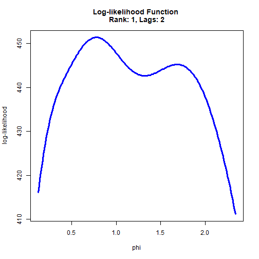

```r
# Constrained 2-dimensional optimization.
# Impose restriction dbMax >= d >= b >= dbMin.
opt <- FCVARoptions()
opt$dbStep1D     <- 0.01
opt$dbStep2D     <- 0.02
# opt$dbStep2D     <- 0.2 # Faster with a coarser grid.
opt$dbMin        <- c(0.01, 0.01) # Set lower bound for d,b.
opt$dbMax        <- c(2.00, 2.00) # Set upper bound for d,b.
opt$constrained  <- 1 # impose restriction dbMax >= d >= b >= dbMin ? 1 <- yes, 0 <- no.
opt$restrictDB   <- 0 # impose restriction d=b ? 1 <- yes, 0 <- no.
opt$progress     <- 2 # Show progress report on each value of b.

likeGrid_params_2D_con <- FCVARlikeGrid(x1, k = 2, r = 1, opt)
```

```
## Now estimating for iteration 0 of 5050: b = 0.010000.
```

```
## Now estimating for iteration 100 of 5050: b = 0.030000.
```

```
## Now estimating for iteration 199 of 5050: b = 0.050000.
```

```
## Now estimating for iteration 297 of 5050: b = 0.070000.
```

```
## Now estimating for iteration 394 of 5050: b = 0.090000.
```

```
## Now estimating for iteration 490 of 5050: b = 0.110000.
```

```
## Now estimating for iteration 585 of 5050: b = 0.130000.
```

```
## Now estimating for iteration 679 of 5050: b = 0.150000.
```

```
## Now estimating for iteration 772 of 5050: b = 0.170000.
```

```
## Now estimating for iteration 864 of 5050: b = 0.190000.
```

```
## Now estimating for iteration 955 of 5050: b = 0.210000.
```

```
## Now estimating for iteration 1045 of 5050: b = 0.230000.
```

```
## Now estimating for iteration 1134 of 5050: b = 0.250000.
```

```
## Now estimating for iteration 1222 of 5050: b = 0.270000.
```

```
## Now estimating for iteration 1309 of 5050: b = 0.290000.
```

```
## Now estimating for iteration 1395 of 5050: b = 0.310000.
```

```
## Now estimating for iteration 1480 of 5050: b = 0.330000.
```

```
## Now estimating for iteration 1564 of 5050: b = 0.350000.
```

```
## Now estimating for iteration 1647 of 5050: b = 0.370000.
```

```
## Now estimating for iteration 1729 of 5050: b = 0.390000.
```

```
## Now estimating for iteration 1810 of 5050: b = 0.410000.
```

```
## Now estimating for iteration 1890 of 5050: b = 0.430000.
```

```
## Now estimating for iteration 1969 of 5050: b = 0.450000.
```

```
## Now estimating for iteration 2047 of 5050: b = 0.470000.
```

```
## Now estimating for iteration 2124 of 5050: b = 0.490000.
```

```
## Now estimating for iteration 2200 of 5050: b = 0.510000.
```

```
## Now estimating for iteration 2275 of 5050: b = 0.530000.
```

```
## Now estimating for iteration 2349 of 5050: b = 0.550000.
```

```
## Now estimating for iteration 2422 of 5050: b = 0.570000.
```

```
## Now estimating for iteration 2494 of 5050: b = 0.590000.
```

```
## Now estimating for iteration 2565 of 5050: b = 0.610000.
```

```
## Now estimating for iteration 2635 of 5050: b = 0.630000.
```

```
## Now estimating for iteration 2704 of 5050: b = 0.650000.
```

```
## Now estimating for iteration 2772 of 5050: b = 0.670000.
```

```
## Now estimating for iteration 2839 of 5050: b = 0.690000.
```

```
## Now estimating for iteration 2905 of 5050: b = 0.710000.
```

```
## Now estimating for iteration 2970 of 5050: b = 0.730000.
```

```
## Now estimating for iteration 3034 of 5050: b = 0.750000.
```

```
## Now estimating for iteration 3097 of 5050: b = 0.770000.
```

```
## Now estimating for iteration 3159 of 5050: b = 0.790000.
```

```
## Now estimating for iteration 3220 of 5050: b = 0.810000.
```

```
## Now estimating for iteration 3280 of 5050: b = 0.830000.
```

```
## Now estimating for iteration 3339 of 5050: b = 0.850000.
```

```
## Now estimating for iteration 3397 of 5050: b = 0.870000.
```

```
## Now estimating for iteration 3454 of 5050: b = 0.890000.
```

```
## Now estimating for iteration 3510 of 5050: b = 0.910000.
```

```
## Now estimating for iteration 3565 of 5050: b = 0.930000.
```

```
## Now estimating for iteration 3619 of 5050: b = 0.950000.
```

```
## Now estimating for iteration 3672 of 5050: b = 0.970000.
```

```
## Now estimating for iteration 3724 of 5050: b = 0.990000.
```

```
## Now estimating for iteration 3775 of 5050: b = 1.010000.
```

```
## Now estimating for iteration 3825 of 5050: b = 1.030000.
```

```
## Now estimating for iteration 3874 of 5050: b = 1.050000.
```

```
## Now estimating for iteration 3922 of 5050: b = 1.070000.
```

```
## Now estimating for iteration 3969 of 5050: b = 1.090000.
```

```
## Now estimating for iteration 4015 of 5050: b = 1.110000.
```

```
## Now estimating for iteration 4060 of 5050: b = 1.130000.
```

```
## Now estimating for iteration 4104 of 5050: b = 1.150000.
```

```
## Now estimating for iteration 4147 of 5050: b = 1.170000.
```

```
## Now estimating for iteration 4189 of 5050: b = 1.190000.
```

```
## Now estimating for iteration 4230 of 5050: b = 1.210000.
```

```
## Now estimating for iteration 4270 of 5050: b = 1.230000.
```

```
## Now estimating for iteration 4309 of 5050: b = 1.250000.
```

```
## Now estimating for iteration 4347 of 5050: b = 1.270000.
```

```
## Now estimating for iteration 4384 of 5050: b = 1.290000.
```

```
## Now estimating for iteration 4420 of 5050: b = 1.310000.
```

```
## Now estimating for iteration 4455 of 5050: b = 1.330000.
```

```
## Now estimating for iteration 4489 of 5050: b = 1.350000.
```

```
## Now estimating for iteration 4522 of 5050: b = 1.370000.
```

```
## Now estimating for iteration 4554 of 5050: b = 1.390000.
```

```
## Now estimating for iteration 4585 of 5050: b = 1.410000.
```

```
## Now estimating for iteration 4615 of 5050: b = 1.430000.
```

```
## Now estimating for iteration 4644 of 5050: b = 1.450000.
```

```
## Now estimating for iteration 4672 of 5050: b = 1.470000.
```

```
## Now estimating for iteration 4699 of 5050: b = 1.490000.
```

```
## Now estimating for iteration 4725 of 5050: b = 1.510000.
```

```
## Now estimating for iteration 4750 of 5050: b = 1.530000.
```

```
## Now estimating for iteration 4774 of 5050: b = 1.550000.
```

```
## Now estimating for iteration 4797 of 5050: b = 1.570000.
```

```
## Now estimating for iteration 4819 of 5050: b = 1.590000.
```

```
## Now estimating for iteration 4840 of 5050: b = 1.610000.
```

```
## Now estimating for iteration 4860 of 5050: b = 1.630000.
```

```
## Now estimating for iteration 4879 of 5050: b = 1.650000.
```

```
## Now estimating for iteration 4897 of 5050: b = 1.670000.
```

```
## Now estimating for iteration 4914 of 5050: b = 1.690000.
```

```
## Now estimating for iteration 4930 of 5050: b = 1.710000.
```

```
## Now estimating for iteration 4945 of 5050: b = 1.730000.
```

```
## Now estimating for iteration 4959 of 5050: b = 1.750000.
```

```
## Now estimating for iteration 4972 of 5050: b = 1.770000.
```

```
## Now estimating for iteration 4984 of 5050: b = 1.790000.
```

```
## Now estimating for iteration 4995 of 5050: b = 1.810000.
```

```
## Now estimating for iteration 5005 of 5050: b = 1.830000.
```

```
## Now estimating for iteration 5014 of 5050: b = 1.850000.
```

```
## Now estimating for iteration 5022 of 5050: b = 1.870000.
```

```
## Now estimating for iteration 5029 of 5050: b = 1.890000.
```

```
## Now estimating for iteration 5035 of 5050: b = 1.910000.
```

```
## Now estimating for iteration 5040 of 5050: b = 1.930000.
```

```
## Now estimating for iteration 5044 of 5050: b = 1.950000.
```

```
## Now estimating for iteration 5047 of 5050: b = 1.970000.
```

```
## Now estimating for iteration 5049 of 5050: b = 1.990000.
```

```
## Progress : 100.0%, b = 0.57, d = 0.57, like = 451.174.
```

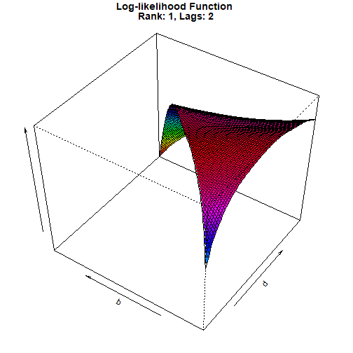

```r
# Unconstrained 2-dimensional optimization.
opt <- FCVARoptions()
opt$dbStep1D     <- 0.01
opt$dbStep2D     <- 0.01
# opt$dbStep2D     <- 0.2 # Faster with a coarser grid.
opt$dbMin        <- c(0.01, 0.01) # Set lower bound for d,b.
opt$dbMax        <- c(2.00, 2.00) # Set upper bound for d,b.
opt$constrained  <- 0 # impose restriction dbMax >= d >= b >= dbMin ? 1 <- yes, 0 <- no.
opt$restrictDB   <- 0 # impose restriction d=b ? 1 <- yes, 0 <- no.
opt$progress     <- 2 # Show progress report on each value of b.

likeGrid_params_2D_unc <- FCVARlikeGrid(x1, k = 2, r = 1, opt)
```

```
## Now estimating for iteration 0 of 40000: b = 0.010000.
```

```
## Now estimating for iteration 200 of 40000: b = 0.020000.
```

```
## Now estimating for iteration 400 of 40000: b = 0.030000.
```

```
## Now estimating for iteration 600 of 40000: b = 0.040000.
```

```
## Now estimating for iteration 800 of 40000: b = 0.050000.
```

```
## Now estimating for iteration 1000 of 40000: b = 0.060000.
```

```
## Now estimating for iteration 1200 of 40000: b = 0.070000.
```

```
## Now estimating for iteration 1400 of 40000: b = 0.080000.
```

```
## Now estimating for iteration 1600 of 40000: b = 0.090000.
```

```
## Now estimating for iteration 1800 of 40000: b = 0.100000.
```

```
## Now estimating for iteration 2000 of 40000: b = 0.110000.
```

```
## Now estimating for iteration 2200 of 40000: b = 0.120000.
```

```
## Now estimating for iteration 2400 of 40000: b = 0.130000.
```

```
## Now estimating for iteration 2600 of 40000: b = 0.140000.
```

```
## Now estimating for iteration 2800 of 40000: b = 0.150000.
```

```
## Now estimating for iteration 3000 of 40000: b = 0.160000.
```

```
## Now estimating for iteration 3200 of 40000: b = 0.170000.
```

```
## Now estimating for iteration 3400 of 40000: b = 0.180000.
```

```
## Now estimating for iteration 3600 of 40000: b = 0.190000.
```

```
## Now estimating for iteration 3800 of 40000: b = 0.200000.
```

```
## Now estimating for iteration 4000 of 40000: b = 0.210000.
```

```
## Now estimating for iteration 4200 of 40000: b = 0.220000.
```

```
## Now estimating for iteration 4400 of 40000: b = 0.230000.
```

```
## Now estimating for iteration 4600 of 40000: b = 0.240000.
```

```
## Now estimating for iteration 4800 of 40000: b = 0.250000.
```

```
## Now estimating for iteration 5000 of 40000: b = 0.260000.
```

```
## Now estimating for iteration 5200 of 40000: b = 0.270000.
```

```
## Now estimating for iteration 5400 of 40000: b = 0.280000.
```

```
## Now estimating for iteration 5600 of 40000: b = 0.290000.
```

```
## Now estimating for iteration 5800 of 40000: b = 0.300000.
```

```
## Now estimating for iteration 6000 of 40000: b = 0.310000.
```

```
## Now estimating for iteration 6200 of 40000: b = 0.320000.
```

```
## Now estimating for iteration 6400 of 40000: b = 0.330000.
```

```
## Now estimating for iteration 6600 of 40000: b = 0.340000.
```

```
## Now estimating for iteration 6800 of 40000: b = 0.350000.
```

```
## Now estimating for iteration 7000 of 40000: b = 0.360000.
```

```
## Now estimating for iteration 7200 of 40000: b = 0.370000.
```

```
## Now estimating for iteration 7400 of 40000: b = 0.380000.
```

```
## Now estimating for iteration 7600 of 40000: b = 0.390000.
```

```
## Now estimating for iteration 7800 of 40000: b = 0.400000.
```

```
## Now estimating for iteration 8000 of 40000: b = 0.410000.
```

```
## Now estimating for iteration 8200 of 40000: b = 0.420000.
```

```
## Now estimating for iteration 8400 of 40000: b = 0.430000.
```

```
## Now estimating for iteration 8600 of 40000: b = 0.440000.
```

```
## Now estimating for iteration 8800 of 40000: b = 0.450000.
```

```
## Now estimating for iteration 9000 of 40000: b = 0.460000.
```

```
## Now estimating for iteration 9200 of 40000: b = 0.470000.
```

```
## Now estimating for iteration 9400 of 40000: b = 0.480000.
```

```
## Now estimating for iteration 9600 of 40000: b = 0.490000.
```

```
## Now estimating for iteration 9800 of 40000: b = 0.500000.
```

```
## Now estimating for iteration 10000 of 40000: b = 0.510000.
```

```
## Now estimating for iteration 10200 of 40000: b = 0.520000.
```

```
## Now estimating for iteration 10400 of 40000: b = 0.530000.
```

```
## Now estimating for iteration 10600 of 40000: b = 0.540000.
```

```
## Now estimating for iteration 10800 of 40000: b = 0.550000.
```

```
## Now estimating for iteration 11000 of 40000: b = 0.560000.
```

```
## Now estimating for iteration 11200 of 40000: b = 0.570000.
```

```
## Now estimating for iteration 11400 of 40000: b = 0.580000.
```

```
## Now estimating for iteration 11600 of 40000: b = 0.590000.
```

```
## Now estimating for iteration 11800 of 40000: b = 0.600000.
```

```
## Now estimating for iteration 12000 of 40000: b = 0.610000.
```

```
## Now estimating for iteration 12200 of 40000: b = 0.620000.
```

```
## Now estimating for iteration 12400 of 40000: b = 0.630000.
```

```
## Now estimating for iteration 12600 of 40000: b = 0.640000.
```

```
## Now estimating for iteration 12800 of 40000: b = 0.650000.
```

```
## Now estimating for iteration 13000 of 40000: b = 0.660000.
```

```
## Now estimating for iteration 13200 of 40000: b = 0.670000.
```

```
## Now estimating for iteration 13400 of 40000: b = 0.680000.
```

```
## Now estimating for iteration 13600 of 40000: b = 0.690000.
```

```
## Now estimating for iteration 13800 of 40000: b = 0.700000.
```

```
## Now estimating for iteration 14000 of 40000: b = 0.710000.
```

```
## Now estimating for iteration 14200 of 40000: b = 0.720000.
```

```
## Now estimating for iteration 14400 of 40000: b = 0.730000.
```

```
## Now estimating for iteration 14600 of 40000: b = 0.740000.
```

```
## Now estimating for iteration 14800 of 40000: b = 0.750000.
```

```
## Now estimating for iteration 15000 of 40000: b = 0.760000.
```

```
## Now estimating for iteration 15200 of 40000: b = 0.770000.
```

```
## Now estimating for iteration 15400 of 40000: b = 0.780000.
```

```
## Now estimating for iteration 15600 of 40000: b = 0.790000.
```

```
## Now estimating for iteration 15800 of 40000: b = 0.800000.
```

```
## Now estimating for iteration 16000 of 40000: b = 0.810000.
```

```
## Now estimating for iteration 16200 of 40000: b = 0.820000.
```

```
## Now estimating for iteration 16400 of 40000: b = 0.830000.
```

```
## Now estimating for iteration 16600 of 40000: b = 0.840000.
```

```
## Now estimating for iteration 16800 of 40000: b = 0.850000.
```

```
## Now estimating for iteration 17000 of 40000: b = 0.860000.
```

```
## Now estimating for iteration 17200 of 40000: b = 0.870000.
```

```
## Now estimating for iteration 17400 of 40000: b = 0.880000.
```

```
## Now estimating for iteration 17600 of 40000: b = 0.890000.
```

```
## Now estimating for iteration 17800 of 40000: b = 0.900000.
```

```
## Now estimating for iteration 18000 of 40000: b = 0.910000.
```

```
## Now estimating for iteration 18200 of 40000: b = 0.920000.
```

```
## Now estimating for iteration 18400 of 40000: b = 0.930000.
```

```
## Now estimating for iteration 18600 of 40000: b = 0.940000.
```

```
## Now estimating for iteration 18800 of 40000: b = 0.950000.
```

```
## Now estimating for iteration 19000 of 40000: b = 0.960000.
```

```
## Now estimating for iteration 19200 of 40000: b = 0.970000.
```

```
## Now estimating for iteration 19400 of 40000: b = 0.980000.
```

```
## Now estimating for iteration 19600 of 40000: b = 0.990000.
```

```
## Now estimating for iteration 19800 of 40000: b = 1.000000.
```

```
## Now estimating for iteration 20000 of 40000: b = 1.010000.
```

```
## Now estimating for iteration 20200 of 40000: b = 1.020000.
```

```
## Now estimating for iteration 20400 of 40000: b = 1.030000.
```

```
## Now estimating for iteration 20600 of 40000: b = 1.040000.
```

```
## Now estimating for iteration 20800 of 40000: b = 1.050000.
```

```
## Now estimating for iteration 21000 of 40000: b = 1.060000.
```

```
## Now estimating for iteration 21200 of 40000: b = 1.070000.
```

```
## Now estimating for iteration 21400 of 40000: b = 1.080000.
```

```
## Now estimating for iteration 21600 of 40000: b = 1.090000.
```

```
## Now estimating for iteration 21800 of 40000: b = 1.100000.
```

```
## Now estimating for iteration 22000 of 40000: b = 1.110000.
```

```
## Now estimating for iteration 22200 of 40000: b = 1.120000.
```

```
## Now estimating for iteration 22400 of 40000: b = 1.130000.
```

```
## Now estimating for iteration 22600 of 40000: b = 1.140000.
```

```
## Now estimating for iteration 22800 of 40000: b = 1.150000.
```

```
## Now estimating for iteration 23000 of 40000: b = 1.160000.
```

```
## Now estimating for iteration 23200 of 40000: b = 1.170000.
```

```
## Now estimating for iteration 23400 of 40000: b = 1.180000.
```

```
## Now estimating for iteration 23600 of 40000: b = 1.190000.
```

```
## Now estimating for iteration 23800 of 40000: b = 1.200000.
```

```
## Now estimating for iteration 24000 of 40000: b = 1.210000.
```

```
## Now estimating for iteration 24200 of 40000: b = 1.220000.
```

```
## Now estimating for iteration 24400 of 40000: b = 1.230000.
```

```
## Now estimating for iteration 24600 of 40000: b = 1.240000.
```

```
## Now estimating for iteration 24800 of 40000: b = 1.250000.
```

```
## Now estimating for iteration 25000 of 40000: b = 1.260000.
```

```
## Now estimating for iteration 25200 of 40000: b = 1.270000.
```

```
## Now estimating for iteration 25400 of 40000: b = 1.280000.
```

```
## Now estimating for iteration 25600 of 40000: b = 1.290000.
```

```
## Now estimating for iteration 25800 of 40000: b = 1.300000.
```

```
## Now estimating for iteration 26000 of 40000: b = 1.310000.
```

```
## Now estimating for iteration 26200 of 40000: b = 1.320000.
```

```
## Now estimating for iteration 26400 of 40000: b = 1.330000.
```

```
## Now estimating for iteration 26600 of 40000: b = 1.340000.
```

```
## Now estimating for iteration 26800 of 40000: b = 1.350000.
```

```
## Now estimating for iteration 27000 of 40000: b = 1.360000.
```

```
## Now estimating for iteration 27200 of 40000: b = 1.370000.
```

```
## Now estimating for iteration 27400 of 40000: b = 1.380000.
```

```
## Now estimating for iteration 27600 of 40000: b = 1.390000.
```

```
## Now estimating for iteration 27800 of 40000: b = 1.400000.
```

```
## Now estimating for iteration 28000 of 40000: b = 1.410000.
```

```
## Now estimating for iteration 28200 of 40000: b = 1.420000.
```

```
## Now estimating for iteration 28400 of 40000: b = 1.430000.
```

```
## Now estimating for iteration 28600 of 40000: b = 1.440000.
```

```
## Now estimating for iteration 28800 of 40000: b = 1.450000.
```

```
## Now estimating for iteration 29000 of 40000: b = 1.460000.
```

```
## Now estimating for iteration 29200 of 40000: b = 1.470000.
```

```
## Now estimating for iteration 29400 of 40000: b = 1.480000.
```

```
## Now estimating for iteration 29600 of 40000: b = 1.490000.
```

```
## Now estimating for iteration 29800 of 40000: b = 1.500000.
```

```
## Now estimating for iteration 30000 of 40000: b = 1.510000.
```

```
## Now estimating for iteration 30200 of 40000: b = 1.520000.
```

```
## Now estimating for iteration 30400 of 40000: b = 1.530000.
```

```
## Now estimating for iteration 30600 of 40000: b = 1.540000.
```

```
## Now estimating for iteration 30800 of 40000: b = 1.550000.
```

```
## Now estimating for iteration 31000 of 40000: b = 1.560000.
```

```
## Now estimating for iteration 31200 of 40000: b = 1.570000.
```

```
## Now estimating for iteration 31400 of 40000: b = 1.580000.
```

```
## Now estimating for iteration 31600 of 40000: b = 1.590000.
```

```
## Now estimating for iteration 31800 of 40000: b = 1.600000.
```

```
## Now estimating for iteration 32000 of 40000: b = 1.610000.
```

```
## Now estimating for iteration 32200 of 40000: b = 1.620000.
```

```
## Now estimating for iteration 32400 of 40000: b = 1.630000.
```

```
## Now estimating for iteration 32600 of 40000: b = 1.640000.
```

```
## Now estimating for iteration 32800 of 40000: b = 1.650000.
```

```
## Now estimating for iteration 33000 of 40000: b = 1.660000.
```

```
## Now estimating for iteration 33200 of 40000: b = 1.670000.
```

```
## Now estimating for iteration 33400 of 40000: b = 1.680000.
```

```
## Now estimating for iteration 33600 of 40000: b = 1.690000.
```

```
## Now estimating for iteration 33800 of 40000: b = 1.700000.
```

```
## Now estimating for iteration 34000 of 40000: b = 1.710000.
```

```
## Now estimating for iteration 34200 of 40000: b = 1.720000.
```

```
## Now estimating for iteration 34400 of 40000: b = 1.730000.
```

```
## Now estimating for iteration 34600 of 40000: b = 1.740000.
```

```
## Now estimating for iteration 34800 of 40000: b = 1.750000.
```

```
## Now estimating for iteration 35000 of 40000: b = 1.760000.
```

```
## Now estimating for iteration 35200 of 40000: b = 1.770000.
```

```
## Now estimating for iteration 35400 of 40000: b = 1.780000.
```

```
## Now estimating for iteration 35600 of 40000: b = 1.790000.
```

```
## Now estimating for iteration 35800 of 40000: b = 1.800000.
```

```
## Now estimating for iteration 36000 of 40000: b = 1.810000.
```

```
## Now estimating for iteration 36200 of 40000: b = 1.820000.
```

```
## Now estimating for iteration 36400 of 40000: b = 1.830000.
```

```
## Now estimating for iteration 36600 of 40000: b = 1.840000.
```

```
## Now estimating for iteration 36800 of 40000: b = 1.850000.
```

```
## Now estimating for iteration 37000 of 40000: b = 1.860000.
```

```
## Now estimating for iteration 37200 of 40000: b = 1.870000.
```

```
## Now estimating for iteration 37400 of 40000: b = 1.880000.
```

```
## Now estimating for iteration 37600 of 40000: b = 1.890000.
```

```
## Now estimating for iteration 37800 of 40000: b = 1.900000.
```

```
## Now estimating for iteration 38000 of 40000: b = 1.910000.
```

```
## Now estimating for iteration 38200 of 40000: b = 1.920000.
```

```
## Now estimating for iteration 38400 of 40000: b = 1.930000.
```

```
## Now estimating for iteration 38600 of 40000: b = 1.940000.
```

```
## Now estimating for iteration 38800 of 40000: b = 1.950000.
```

```
## Now estimating for iteration 39000 of 40000: b = 1.960000.
```

```
## Now estimating for iteration 39200 of 40000: b = 1.970000.
```

```
## Now estimating for iteration 39400 of 40000: b = 1.980000.
```

```
## Now estimating for iteration 39600 of 40000: b = 1.990000.
```

```
## Now estimating for iteration 39800 of 40000: b = 2.000000.
```

```
## Grid search did not find a unique maximum of the log-likelihood function.
## Inspect the plot of the log-likelihood function to verify your choice of the LocalMax option.
```

```
## Progress : 100.0%, b = 1.61, d = 0.90, like = 455.046.
```


```r
# Revisit linear restriction on fractional parameters
# to investigate likelihood function with multiple local optima.
```

```r
# Linear restriction on fractional parameters.
opt <- FCVARoptions(
  dbStep1D     = 0.01,
  dbMin        = c(0.01, 0.01), # Set lower bound for d,b.
  dbMax        = c(2.00, 2.00), # Set upper bound for d,b.
  constrained  = 0, # Impose restriction dbMax >= d >= b >= dbMin ? 1 => yes, 0 => no.
  restrictDB   = 0) # Impose restriction d=b ? 1 => yes, 0 => no.

# Impose linear restriction on d and b:
opt$R_psi        <- matrix(c(2, -1), nrow = 1, ncol = 2)
opt$r_psi        <- 0.5
opt$progress     <- 2 # Show progress report on each value of b.

likeGrid_params_lin_con <- FCVARlikeGrid(x1, k = 2, r = 1, opt)
```

```
## Now estimating for iteration 0 of 223: b = 0.122984.
```

```
## Now estimating for iteration 1 of 223: b = 0.132984.
```

```
## Now estimating for iteration 2 of 223: b = 0.142984.
```

```
## Now estimating for iteration 3 of 223: b = 0.152984.
```

```
## Now estimating for iteration 4 of 223: b = 0.162984.
```

```
## Now estimating for iteration 5 of 223: b = 0.172984.
```

```
## Now estimating for iteration 6 of 223: b = 0.182984.
```

```
## Now estimating for iteration 7 of 223: b = 0.192984.
```

```
## Now estimating for iteration 8 of 223: b = 0.202984.
```

```
## Now estimating for iteration 9 of 223: b = 0.212984.
```

```
## Now estimating for iteration 10 of 223: b = 0.222984.
```

```
## Now estimating for iteration 11 of 223: b = 0.232984.
```

```
## Now estimating for iteration 12 of 223: b = 0.242984.
```

```
## Now estimating for iteration 13 of 223: b = 0.252984.
```

```
## Now estimating for iteration 14 of 223: b = 0.262984.
```

```
## Now estimating for iteration 15 of 223: b = 0.272984.
```

```
## Now estimating for iteration 16 of 223: b = 0.282984.
```

```
## Now estimating for iteration 17 of 223: b = 0.292984.
```

```
## Now estimating for iteration 18 of 223: b = 0.302984.
```

```
## Now estimating for iteration 19 of 223: b = 0.312984.
```

```
## Now estimating for iteration 20 of 223: b = 0.322984.
```

```
## Now estimating for iteration 21 of 223: b = 0.332984.
```

```
## Now estimating for iteration 22 of 223: b = 0.342984.
```

```
## Now estimating for iteration 23 of 223: b = 0.352984.
```

```
## Now estimating for iteration 24 of 223: b = 0.362984.
```

```
## Now estimating for iteration 25 of 223: b = 0.372984.
```

```
## Now estimating for iteration 26 of 223: b = 0.382984.
```

```
## Now estimating for iteration 27 of 223: b = 0.392984.
```

```
## Now estimating for iteration 28 of 223: b = 0.402984.
```

```
## Now estimating for iteration 29 of 223: b = 0.412984.
```

```
## Now estimating for iteration 30 of 223: b = 0.422984.
```

```
## Now estimating for iteration 31 of 223: b = 0.432984.
```

```
## Now estimating for iteration 32 of 223: b = 0.442984.
```

```
## Now estimating for iteration 33 of 223: b = 0.452984.
```

```
## Now estimating for iteration 34 of 223: b = 0.462984.
```

```
## Now estimating for iteration 35 of 223: b = 0.472984.
```

```
## Now estimating for iteration 36 of 223: b = 0.482984.
```

```
## Now estimating for iteration 37 of 223: b = 0.492984.
```

```
## Now estimating for iteration 38 of 223: b = 0.502984.
```

```
## Now estimating for iteration 39 of 223: b = 0.512984.
```

```
## Now estimating for iteration 40 of 223: b = 0.522984.
```

```
## Now estimating for iteration 41 of 223: b = 0.532984.
```

```
## Now estimating for iteration 42 of 223: b = 0.542984.
```

```
## Now estimating for iteration 43 of 223: b = 0.552984.
```

```
## Now estimating for iteration 44 of 223: b = 0.562984.
```

```
## Now estimating for iteration 45 of 223: b = 0.572984.
```

```
## Now estimating for iteration 46 of 223: b = 0.582984.
```

```
## Now estimating for iteration 47 of 223: b = 0.592984.
```

```
## Now estimating for iteration 48 of 223: b = 0.602984.
```

```
## Now estimating for iteration 49 of 223: b = 0.612984.
```

```
## Now estimating for iteration 50 of 223: b = 0.622984.
```

```
## Now estimating for iteration 51 of 223: b = 0.632984.
```

```
## Now estimating for iteration 52 of 223: b = 0.642984.
```

```
## Now estimating for iteration 53 of 223: b = 0.652984.
```

```
## Now estimating for iteration 54 of 223: b = 0.662984.
```

```
## Now estimating for iteration 55 of 223: b = 0.672984.
```

```
## Now estimating for iteration 56 of 223: b = 0.682984.
```

```
## Now estimating for iteration 57 of 223: b = 0.692984.
```

```
## Now estimating for iteration 58 of 223: b = 0.702984.
```

```
## Now estimating for iteration 59 of 223: b = 0.712984.
```

```
## Now estimating for iteration 60 of 223: b = 0.722984.
```

```
## Now estimating for iteration 61 of 223: b = 0.732984.
```

```
## Now estimating for iteration 62 of 223: b = 0.742984.
```

```
## Now estimating for iteration 63 of 223: b = 0.752984.
```

```
## Now estimating for iteration 64 of 223: b = 0.762984.
```

```
## Now estimating for iteration 65 of 223: b = 0.772984.
```

```
## Now estimating for iteration 66 of 223: b = 0.782984.
```

```
## Now estimating for iteration 67 of 223: b = 0.792984.
```

```
## Now estimating for iteration 68 of 223: b = 0.802984.
```

```
## Now estimating for iteration 69 of 223: b = 0.812984.
```

```
## Now estimating for iteration 70 of 223: b = 0.822984.
```

```
## Now estimating for iteration 71 of 223: b = 0.832984.
```

```
## Now estimating for iteration 72 of 223: b = 0.842984.
```

```
## Now estimating for iteration 73 of 223: b = 0.852984.
```

```
## Now estimating for iteration 74 of 223: b = 0.862984.
```

```
## Now estimating for iteration 75 of 223: b = 0.872984.
```

```
## Now estimating for iteration 76 of 223: b = 0.882984.
```

```
## Now estimating for iteration 77 of 223: b = 0.892984.
```

```
## Now estimating for iteration 78 of 223: b = 0.902984.
```

```
## Now estimating for iteration 79 of 223: b = 0.912984.
```

```
## Now estimating for iteration 80 of 223: b = 0.922984.
```

```
## Now estimating for iteration 81 of 223: b = 0.932984.
```

```
## Now estimating for iteration 82 of 223: b = 0.942984.
```

```
## Now estimating for iteration 83 of 223: b = 0.952984.
```

```
## Now estimating for iteration 84 of 223: b = 0.962984.
```

```
## Now estimating for iteration 85 of 223: b = 0.972984.
```

```
## Now estimating for iteration 86 of 223: b = 0.982984.
```

```
## Now estimating for iteration 87 of 223: b = 0.992984.
```

```
## Now estimating for iteration 88 of 223: b = 1.002984.
```

```
## Now estimating for iteration 89 of 223: b = 1.012984.
```

```
## Now estimating for iteration 90 of 223: b = 1.022984.
```

```
## Now estimating for iteration 91 of 223: b = 1.032984.
```

```
## Now estimating for iteration 92 of 223: b = 1.042984.
```

```
## Now estimating for iteration 93 of 223: b = 1.052984.
```

```
## Now estimating for iteration 94 of 223: b = 1.062984.
```

```
## Now estimating for iteration 95 of 223: b = 1.072984.
```

```
## Now estimating for iteration 96 of 223: b = 1.082984.
```

```
## Now estimating for iteration 97 of 223: b = 1.092984.
```

```
## Now estimating for iteration 98 of 223: b = 1.102984.
```

```
## Now estimating for iteration 99 of 223: b = 1.112984.
```

```
## Now estimating for iteration 100 of 223: b = 1.122984.
```

```
## Now estimating for iteration 101 of 223: b = 1.132984.
```

```
## Now estimating for iteration 102 of 223: b = 1.142984.
```

```
## Now estimating for iteration 103 of 223: b = 1.152984.
```

```
## Now estimating for iteration 104 of 223: b = 1.162984.
```

```
## Now estimating for iteration 105 of 223: b = 1.172984.
```

```
## Now estimating for iteration 106 of 223: b = 1.182984.
```

```
## Now estimating for iteration 107 of 223: b = 1.192984.
```

```
## Now estimating for iteration 108 of 223: b = 1.202984.
```

```
## Now estimating for iteration 109 of 223: b = 1.212984.
```

```
## Now estimating for iteration 110 of 223: b = 1.222984.
```

```
## Now estimating for iteration 111 of 223: b = 1.232984.
```

```
## Now estimating for iteration 112 of 223: b = 1.242984.
```

```
## Now estimating for iteration 113 of 223: b = 1.252984.
```

```
## Now estimating for iteration 114 of 223: b = 1.262984.
```

```
## Now estimating for iteration 115 of 223: b = 1.272984.
```

```
## Now estimating for iteration 116 of 223: b = 1.282984.
```

```
## Now estimating for iteration 117 of 223: b = 1.292984.
```

```
## Now estimating for iteration 118 of 223: b = 1.302984.
```

```
## Now estimating for iteration 119 of 223: b = 1.312984.
```

```
## Now estimating for iteration 120 of 223: b = 1.322984.
```

```
## Now estimating for iteration 121 of 223: b = 1.332984.
```

```
## Now estimating for iteration 122 of 223: b = 1.342984.
```

```
## Now estimating for iteration 123 of 223: b = 1.352984.
```

```
## Now estimating for iteration 124 of 223: b = 1.362984.
```

```
## Now estimating for iteration 125 of 223: b = 1.372984.
```

```
## Now estimating for iteration 126 of 223: b = 1.382984.
```

```
## Now estimating for iteration 127 of 223: b = 1.392984.
```

```
## Now estimating for iteration 128 of 223: b = 1.402984.
```

```
## Now estimating for iteration 129 of 223: b = 1.412984.
```

```
## Now estimating for iteration 130 of 223: b = 1.422984.
```

```
## Now estimating for iteration 131 of 223: b = 1.432984.
```

```
## Now estimating for iteration 132 of 223: b = 1.442984.
```

```
## Now estimating for iteration 133 of 223: b = 1.452984.
```

```
## Now estimating for iteration 134 of 223: b = 1.462984.
```

```
## Now estimating for iteration 135 of 223: b = 1.472984.
```

```
## Now estimating for iteration 136 of 223: b = 1.482984.
```

```
## Now estimating for iteration 137 of 223: b = 1.492984.
```

```
## Now estimating for iteration 138 of 223: b = 1.502984.
```

```
## Now estimating for iteration 139 of 223: b = 1.512984.
```

```
## Now estimating for iteration 140 of 223: b = 1.522984.
```

```
## Now estimating for iteration 141 of 223: b = 1.532984.
```

```
## Now estimating for iteration 142 of 223: b = 1.542984.
```

```
## Now estimating for iteration 143 of 223: b = 1.552984.
```

```
## Now estimating for iteration 144 of 223: b = 1.562984.
```

```
## Now estimating for iteration 145 of 223: b = 1.572984.
```

```
## Now estimating for iteration 146 of 223: b = 1.582984.
```

```
## Now estimating for iteration 147 of 223: b = 1.592984.
```

```
## Now estimating for iteration 148 of 223: b = 1.602984.
```

```
## Now estimating for iteration 149 of 223: b = 1.612984.
```

```
## Now estimating for iteration 150 of 223: b = 1.622984.
```

```
## Now estimating for iteration 151 of 223: b = 1.632984.
```

```
## Now estimating for iteration 152 of 223: b = 1.642984.
```

```
## Now estimating for iteration 153 of 223: b = 1.652984.
```

```
## Now estimating for iteration 154 of 223: b = 1.662984.
```

```
## Now estimating for iteration 155 of 223: b = 1.672984.
```

```
## Now estimating for iteration 156 of 223: b = 1.682984.
```

```
## Now estimating for iteration 157 of 223: b = 1.692984.
```

```
## Now estimating for iteration 158 of 223: b = 1.702984.
```

```
## Now estimating for iteration 159 of 223: b = 1.712984.
```

```
## Now estimating for iteration 160 of 223: b = 1.722984.
```

```
## Now estimating for iteration 161 of 223: b = 1.732984.
```

```
## Now estimating for iteration 162 of 223: b = 1.742984.
```

```
## Now estimating for iteration 163 of 223: b = 1.752984.
```

```
## Now estimating for iteration 164 of 223: b = 1.762984.
```

```
## Now estimating for iteration 165 of 223: b = 1.772984.
```

```
## Now estimating for iteration 166 of 223: b = 1.782984.
```

```
## Now estimating for iteration 167 of 223: b = 1.792984.
```

```
## Now estimating for iteration 168 of 223: b = 1.802984.
```

```
## Now estimating for iteration 169 of 223: b = 1.812984.
```

```
## Now estimating for iteration 170 of 223: b = 1.822984.
```

```
## Now estimating for iteration 171 of 223: b = 1.832984.
```

```
## Now estimating for iteration 172 of 223: b = 1.842984.
```

```
## Now estimating for iteration 173 of 223: b = 1.852984.
```

```
## Now estimating for iteration 174 of 223: b = 1.862984.
```

```
## Now estimating for iteration 175 of 223: b = 1.872984.
```

```
## Now estimating for iteration 176 of 223: b = 1.882984.
```

```
## Now estimating for iteration 177 of 223: b = 1.892984.
```

```
## Now estimating for iteration 178 of 223: b = 1.902984.
```

```
## Now estimating for iteration 179 of 223: b = 1.912984.
```

```
## Now estimating for iteration 180 of 223: b = 1.922984.
```

```
## Now estimating for iteration 181 of 223: b = 1.932984.
```

```
## Now estimating for iteration 182 of 223: b = 1.942984.
```

```
## Now estimating for iteration 183 of 223: b = 1.952984.
```

```
## Now estimating for iteration 184 of 223: b = 1.962984.
```

```
## Now estimating for iteration 185 of 223: b = 1.972984.
```

```
## Now estimating for iteration 186 of 223: b = 1.982984.
```

```
## Now estimating for iteration 187 of 223: b = 1.992984.
```

```
## Now estimating for iteration 188 of 223: b = 2.002984.
```

```
## Now estimating for iteration 189 of 223: b = 2.012984.
```

```
## Now estimating for iteration 190 of 223: b = 2.022984.
```

```
## Now estimating for iteration 191 of 223: b = 2.032984.
```

```
## Now estimating for iteration 192 of 223: b = 2.042984.
```

```
## Now estimating for iteration 193 of 223: b = 2.052984.
```

```
## Now estimating for iteration 194 of 223: b = 2.062984.
```

```
## Now estimating for iteration 195 of 223: b = 2.072984.
```

```
## Now estimating for iteration 196 of 223: b = 2.082984.
```

```
## Now estimating for iteration 197 of 223: b = 2.092984.
```

```
## Now estimating for iteration 198 of 223: b = 2.102984.
```

```
## Now estimating for iteration 199 of 223: b = 2.112984.
```

```
## Now estimating for iteration 200 of 223: b = 2.122984.
```

```
## Now estimating for iteration 201 of 223: b = 2.132984.
```

```
## Now estimating for iteration 202 of 223: b = 2.142984.
```

```
## Now estimating for iteration 203 of 223: b = 2.152984.
```

```
## Now estimating for iteration 204 of 223: b = 2.162984.
```

```
## Now estimating for iteration 205 of 223: b = 2.172984.
```

```
## Now estimating for iteration 206 of 223: b = 2.182984.
```

```
## Now estimating for iteration 207 of 223: b = 2.192984.
```

```
## Now estimating for iteration 208 of 223: b = 2.202984.
```

```
## Now estimating for iteration 209 of 223: b = 2.212984.
```

```
## Now estimating for iteration 210 of 223: b = 2.222984.
```

```
## Now estimating for iteration 211 of 223: b = 2.232984.
```

```
## Now estimating for iteration 212 of 223: b = 2.242984.
```

```
## Now estimating for iteration 213 of 223: b = 2.252984.
```

```
## Now estimating for iteration 214 of 223: b = 2.262984.
```

```
## Now estimating for iteration 215 of 223: b = 2.272984.
```

```
## Now estimating for iteration 216 of 223: b = 2.282984.
```

```
## Now estimating for iteration 217 of 223: b = 2.292984.
```

```
## Now estimating for iteration 218 of 223: b = 2.302984.
```

```
## Now estimating for iteration 219 of 223: b = 2.312984.
```

```
## Now estimating for iteration 220 of 223: b = 2.322984.
```

```
## Now estimating for iteration 221 of 223: b = 2.332984.
```

```
## Now estimating for iteration 222 of 223: b = 2.342984.
```

```
## Grid search did not find a unique maximum of the log-likelihood function.
## Inspect the plot of the log-likelihood function to verify your choice of the LocalMax option.
```

```
## Progress : 100.0%, b = 1.41, d = 0.95, like = 451.357.
```


```r
# Print grid search output to screen.
likeGrid_params_lin_con$local_max
```

```
## $b
## [1] 0.5913777 1.4053064
## 
## $d
## [1] 0.5456888 0.9526532
## 
## $like
## [1] 451.3568 445.1917
```

```r
################################################################################
# Session Info
################################################################################


# Display the session info.
sessionInfo()
```

```
## R version 4.0.5 (2021-03-31)
## Platform: x86_64-w64-mingw32/x64 (64-bit)
## Running under: Windows 10 x64 (build 19042)
## 
## Matrix products: default
## 
## locale:
## [1] LC_COLLATE=English_United States.1252 
## [2] LC_CTYPE=C                            
## [3] LC_MONETARY=English_United States.1252
## [4] LC_NUMERIC=C                          
## [5] LC_TIME=English_United States.1252    
## system code page: 1252
## 
## attached base packages:
## [1] stats     graphics  grDevices utils     datasets  methods   base     
## 
## other attached packages:
## [1] FCVAR_0.1.1 knitr_1.33 
## 
## loaded via a namespace (and not attached):
##  [1] compiler_4.0.5 magrittr_2.0.1 tools_4.0.5    fracdist_0.1.1 stringi_1.7.3 
##  [6] highr_0.9      stringr_1.4.0  xfun_0.25      pracma_2.3.3   evaluate_0.14
```

```r
################################################################################
# End
################################################################################
```

